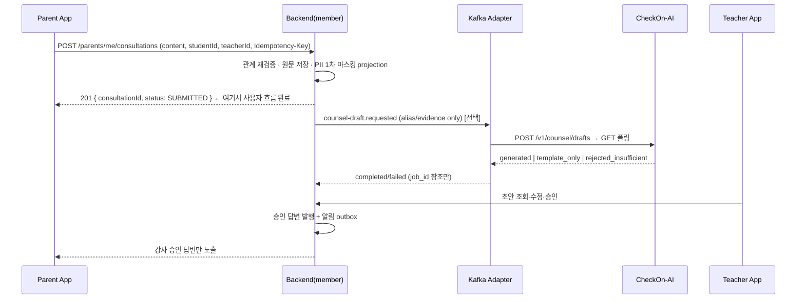

# CheckOn 학생·학부모 백엔드 설계 정본 (member 경계)

> 문서 지위: **설계 정본**. 구현 지시서는 `instructions/PR*.md`, API 계약은 `member-api.yaml`.
> 작성일: 2026-08-24 (KST)
> 실측 기준: `CheckOn-backend` `origin/dev` `daf3468` · `checkon-kafka-adapter` `64cebcb` · `CheckOn-App` `7a7db5d` + 로컬 미커밋 8건 · `CheckOn-AI` 로컬 워킹트리
> 원칙: **여기 적힌 필드명·상수·동작은 전부 파일:줄 근거를 붙였다. 근거 없는 문장은 `[추정]`으로 표시했다.**

---

## 0. 이 문서를 읽는 법

| 무엇 | 어디 |
|---|---|
| 왜 이렇게 나눴나 · 무엇을 건드리면 안 되나 | §2, §3 |
| 인증을 어떻게 붙이나 (🔴 업로드 설계서와 다름) | §4 |
| RLS — 이번 설계의 가장 위험한 부분 | §6 |
| 실제 만들 API 목록 | §8, §9 |
| 오류·동시성·멱등성 전수표 | §12 |
| 프론트에서 정확히 무엇을 고치나 | §13 |
| 구현 순서와 지시서 | §16 |

🔴 표시는 **틀리면 되돌리기 비싼 것**이다.

---

## 1. 결론 — 그리고 업로드 설계서에서 정정한 것

### 1-1. 결론

학생·학부모 API는 공유 백엔드 안 **신규 `com.checkon.member` 경계**가 소유한다. 조회·저장·채점·관계 처리는 전부 백엔드 결정론 코드다. AI는 앱이 직접 부르지 않고, 이미 계약이 있는 비동기 작업(위험 탐지·문제 생성·상담 초안)만 Kafka Adapter를 거친다.

### 1-2. 🔴 업로드 설계서(`studentparentbackendapiintegrationdesign.md`)에서 **틀린 것 6가지**

전부 실측으로 확인했다. 그대로 구현하면 동작하지 않거나 팀원 파일을 건드려야 한다.

| # | 업로드 설계서 주장 | 실측 | 결과 |
|---|---|---|---|
| 1 | `POST /api/v1/member/auth/refresh` 를 신설하고 "member refresh cookie Path는 `/api/v1/member/auth`로 맞춘다"(§5.3) | refresh 쿠키 Path는 `AuthenticationController.java:38`의 `private static final String COOKIE_PATH = "/api/v1/auth"` **상수 하드코딩**. `:117-136`의 `refreshCookie()`/`expiredRefreshCookie()`가 이 상수를 쓴다 | Path를 바꾸려면 **팀원 파일 수정**. → §4에서 **기존 `/api/v1/auth` 재사용**으로 변경 |
| 2 | "`POST /api/v1/member/auth/login` — 기존 LoginService를 통한 access/refresh 발급"(§5.2) | `LoginService.login()`(`LoginService.java:67-113`)에 **role 검사가 없다**. `AuthenticatedAccountService.java:58-62`는 `role != TEACHER`면 `teacherProfileId = null`로 정상 발급 | 기존 `/api/v1/auth/login`이 **학부모에게는 그대로 동작한다**. 🔴 다만 학생은 공개 ID 로그인이라(MB-01) member 가 공개 ID→email 변환 엔드포인트 하나를 신설한다 — `account` 수정은 여전히 0 |
| 3 | "V33은 관계 제약을 구현했지만 학생·학부모 self-access RLS는 없다"(§2-1) — 즉 "없으니 나중에 추가하면 된다"는 뉘앙스 | `V33:105-110`이 세 parent 테이블에 `ENABLE`+`FORCE RLS`를 걸었고 정책은 **teacher 전용뿐**(`:112-210`). 특히 `parent_student_relationships_teacher_insert`(`:153-166`)는 **이미 ACTIVE인 강사↔학부모 관계**를 INSERT 조건으로 요구 | 학부모 자녀 등록이 **물리적으로 불가능**. RLS 정책 추가는 선택이 아니라 **PR2 필수 선행** |
| 4 | 오류 envelope `{ "error": {...}, "meta": {...} }` 를 신규 표준으로(§9.1) | 프론트 `client.ts:12-14` `unwrapErrorPayload`는 `{error:{...}}`와 top-level `{code,message}` **둘 다** 처리. 기존 백엔드는 컨트롤러별 `record ErrorResponse(String code, String message)` | 둘 다 되지만 **팀 내 일관성**을 위해 §7에서 규칙을 고정. 프론트 client 코드 수정은 불필요 |
| 5 | 성공 envelope `{data, meta}` 가 "신규 규약" | `AuthenticationController.AuthenticationResponse` = `record AuthenticationResponse(AuthenticationData data)` — **`/api/v1/auth`는 이미 `{data:...}` 형태** | 신규가 아니라 **기존 인증 API 선례를 따르는 것**. `NEXT_PUBLIC_API_RESPONSE_MODE=wrapped` 로 고정 가능 |
| 6 | 프론트 "학생·학부모 전체 34개 페이지" | `find src/app -name page.tsx` 실측: 학생 22 + 학부모 19 + 루트 1 = **42** (학생 22는 `docs/student-ui-checklist.md:64`와 일치) | 검수 대상 페이지 수를 42로 정정 |

### 1-3. 추가로 실측에서 나온 함정 3가지 (업로드 설계서에 없음)

- 🔴 **`DevelopmentTestAuthenticationFilter`가 dev에서 TEACHER를 자동 주입한다.** `DevelopmentTestAuthenticationFilter.java:36-41` — `properties.enabled()` 이고 URI가 `/api/v1/auth/`로 시작하지 않고 `Authorization` 헤더가 없으면 **고정 TEACHER principal**을 넣는다. `application-dev.yaml`에서 `TEST_AUTH_ENABLED` 기본 `true`. 다만 이 필터는 `@Order(2)` 체인에만 `addFilterBefore` 되어 있으므로, `@Order(0)` member 체인을 신설하면 **member API에는 적용되지 않는다**. → dev에서 member API는 토큰 없이 401이 정상. 이걸 모르면 "왜 강사 API는 되는데 member는 401이냐"로 반나절 태운다.
- 🔴 **`TenantDatabaseRoleSafetyVerifier`는 기동 시 RLS 테이블을 정확히 15개로 센다.** `TenantDatabaseRoleSafetyVerifier.java:27` `RLS_TABLE_COUNT = 15`, `:49-72`에 테이블명 **IN 목록 하드코딩**. 목록이 고정이라 *신규 `member_*` 테이블을 RLS로 만들어도 기동은 깨지지 않는다*. 대신 **member 테이블은 이 검증을 전혀 받지 않는다** → §6-5에서 별도 `MemberDatabaseRoleSafetyVerifier`(신규 파일, 추가만)를 둔다.
- 🔴 **AI 상담 초안은 지금 운영에서 신뢰할 수 없다.** `CheckOn-AI` `docs/99_open_items.md`: `#117` 배포 환경 counsel job이 `worker_internal_error`로 **전량 실패**, `#106` `openai_timeout_s=15`로 실제 상담 호출의 **37% 타임아웃**, `#115` Cloudflare origin timeout 미측정. 또 `src/ai/composition/counsel/settings.py:76` `counsel_inline_drain_max = 0`(2026-08-20 변경)이라 POST는 enqueue-only다. → §11에서 **AI 없이도 상담 전 흐름이 끝나는 것을 기본 경로로** 설계한다.

### 1-4. 🔴 스키마 실측 — 2026-08-25 재측정 (`origin/dev` `daf3468`)

⚠ **이 절은 2026-08-24 `daf3468` 기준으로 썼다가 전면 개정됐다.** 그 사이 dev 가 **22커밋** 움직였고(`ffcb76b feat: 문제 출제 AI 통신 고도화` 포함), 제가 "없다"고 적은 것 중 **셋이 생겼다.** 옛 내용을 따르면 **이미 있는 것을 우회하는 코드**를 만든다.

#### ① 학생·학부모의 표시 이름을 저장할 곳이 없다 — **여전히 유효**

`student_profiles`(`V6:4-32`)에 `name` 이 없다(`alias` 뿐). `parent_profiles`(`V33_support:17-31`)는 `id, account_id, account_role, created_at, updated_at` 이 전부다.

→ member 소유 `member_display_names`(PR3/V39). `student_profiles.alias` 를 덮어쓰지 않는다.

#### ② 강사의 `subject`·`academyName` 원본이 없다 — **여전히 유효**

`teacher_profiles`(`V4:54-74`)는 `display_name` 뿐. `TeacherSummary.academyName` 은 계약에서 삭제했고 `subject` 는 `null` 이다.

#### ③ ~~문항 스냅샷에 정답 번호가 없다~~ → ✅ **해소됨. `correctNo` 가 생겼다**

`V33__advance_problem_generation_ai_contract.sql:99-102` 이 `problem_generation_items` 에 넣었다:

```sql
ADD COLUMN skill_node_id VARCHAR(120),
ADD COLUMN area_tag      VARCHAR(40),
ADD COLUMN type_tag      VARCHAR(20),
ADD COLUMN correct_no    INTEGER,          -- CHECK: NULL 또는 1..5
```

그리고 `snapshotSelectedItems`(`ProblemStudioWorkflowRepository`)가 `item_snapshot` JSONB 에 **전부 넣는다**:

```json
{ "itemId", "ordinal", "skillNodeId", "areaTag", "typeTag", "stem", "passage",
  "correctNo", "correctAnswerText", "explanation", "sourceBasis", "validationStatus",
  "options": [ { "position", "content", "whyWrong", "misconceptionTag" } ] }
```

🔴 **`correctAnswerText` 를 보기와 문자열 매칭해 번호를 역산하던 설계는 폐기한다.** `correctNo` 를 그대로 쓴다.

⚠ 다만 `correct_no` 는 **nullable** 이다(`CHECK (correct_no IS NULL OR correct_no BETWEEN 1 AND 5)`). V33 이전에 만들어진 문항은 NULL 이다. → `WORKSHEET_NOT_GRADABLE` 은 **없애지 않고 조건만 바꾼다**(§1-4 ⑥ 참조).

#### ④ ~~문항에 area·type 태그가 없다~~ → ✅ **해소됨. 문항 단위로 생겼다**

같은 마이그레이션이 `area_tag`·`type_tag`·`skill_node_id` 를 **문항 컬럼으로** 추가했다. CHECK 값도 명시돼 있다:

```sql
area_tag IN ('language','reading','literature','speech_writing','media')   -- 5개, 소문자
type_tag IN ('fact','infer','critic','concept')                            -- 🔴 4개. apply 없음
```

🔴 **`CheckOn-AI` `contracts/taxonomy.py` 와 정확히 일치한다**(`TypeTag` 5개 중 `apply` 는 v1 미생산). 대소문자 변환이 **더는 필요 없다** — 백엔드가 이미 소문자다.

→ "요청 타깃이 1개일 때만 상속, 아니면 NULL" 규칙은 **폐기.** 문항 단위 태그를 그대로 쓴다. 약점 집계 정확도가 올라간다.

#### ⑤ 🔴 **학생 답안 테이블이 이미 생겼다 — `problem_assignment_responses`**

이게 이번 재측정에서 가장 큰 발견이다. `V33_advance:237-296`:

```sql
CREATE TABLE problem_assignment_responses (
    id, teacher_id, assignment_id, student_id, problem_set_id, item_id,
    chosen_no INTEGER NOT NULL,          -- 1..5
    correct_no INTEGER NOT NULL,         -- 🔴 NOT NULL
    correct BOOLEAN NOT NULL,            -- CHECK: correct = (chosen_no = correct_no)
    area_tag VARCHAR(40) NOT NULL,       -- 🔴 NOT NULL
    type_tag VARCHAR(20) NOT NULL,       -- 🔴 NOT NULL
    skill_node_id VARCHAR(120) NOT NULL, -- 🔴 NOT NULL
    misconception_tag VARCHAR(120),      -- CHECK: 정답이면 NULL, 오답이면 필수
    responded_at, created_at,
    UNIQUE (assignment_id, item_id)      -- 🔴 assignment 당 문항별 1행
);
CREATE INDEX idx_problem_response_diagnosis
    ON problem_assignment_responses (teacher_id, student_id, responded_at, id);   -- 진단용
-- RLS: teacher SELECT/INSERT 만. UPDATE·DELETE 는 USING(false) = append-only
```

**이건 제가 만들려던 `member_attempt_item_results` 와 같은 것이다.** 승우님이 **학생 답안 수집을 전제로** 설계했다(`correct_no`·`area_tag`·`type_tag`·`misconception_tag` 추가와 세트, 인덱스 이름이 `diagnosis`).

🔴 **따라서 member 는 자기 결과 테이블을 만들지 않는다.**

| 무엇 | 어디에 |
|---|---|
| **진행 중** 임시 답안·타이머 (미제출) | `member_attempt_answers` (member 소유, PR5/V40) |
| **최종 제출 결과** (문항별 정오) | 🔴 **`problem_assignment_responses`** (승우님 소유). member 는 INSERT 만 |
| ~~`member_attempt_item_results`~~ | 🔴 **만들지 않는다.** 중복이다 |

→ V38 에 **9번째 테이블** 로 `problem_assignment_responses` 학생 INSERT 정책을 추가한다(§6-3).

이득: 강사 대시보드·진단이 학생 제출을 **바로** 본다. 데이터가 두 벌로 갈리지 않는다.

🔴 **미확정 `MB-28`**: `learning_records`(detection 이 사용)와 `problem_assignment_responses`(diagnosis 가 사용) **둘 다** 써야 하는가, 하나면 되는가. 지금은 **둘 다 쓴다**로 가되(기존 강사 위험탐지가 `learning_records` 에 의존), 승우님께 물어 확정한다.

#### ⑥ `WORKSHEET_NOT_GRADABLE` — 조건이 바뀐다

`problem_assignment_responses` 의 `correct_no`·`area_tag`·`type_tag`·`skill_node_id` 가 **전부 NOT NULL** 이다. 문항 스냅샷에 이 넷 중 하나라도 없으면 **답안을 기록할 수 없다.**

```text
옛 조건: correctAnswerText 를 보기와 매칭해 번호를 못 찾음        ← 폐기
새 조건: item_snapshot 의 correctNo · areaTag · typeTag · skillNodeId
         중 하나라도 null            → 422 WORKSHEET_NOT_GRADABLE
```

판정은 **attempt 시작 시점**에 한다(제출 때가 아니라). `details.itemIds[]` 에 어떤 문항이 왜 걸렸는지 담는다.

#### ⑦ 학습지 1개 = 학생 1명 — **여전히 유효**

`publish()` 가 `ON CONFLICT (problem_request_id) DO NOTHING` 이고 `problem_assignments.problem_request_id` 가 UNIQUE 다. `problem_assignments` 에 **제목 컬럼은 여전히 없다** — `WorksheetSummary.title` 은 파생값이고 규칙을 주석에 남긴다.

---

### 1-5. 🔴 보안 체인이 바뀌었다 (`61bd843`)

```java
// daf3468 — 경로별 매처 8개
.requestMatchers("/api/v1/dashboard/**", "/api/v1/classes/**",
                 "/api/v1/students/**", ...).hasRole("TEACHER")

// daf3468 — 한 줄로 통합
.requestMatchers("/api/v1/**").hasRole("TEACHER")     // 🔴
.requestMatchers("/api/dev/**").hasRole("TEACHER")
.anyRequest().authenticated()
```

주석까지 달려 있다: *"새 Controller 가 추가돼도 명시적으로 열기 전까지 TEACHER 로 닫는다."*

**member 설계에 미치는 영향:**

- `@Order(0)` + `securityMatcher("/api/v1/member/**")` 로 먼저 가로채는 구조는 **그대로 유효**하다. `@Order(0)` 이 `@Order(2)` 보다 앞이라 도달조차 하지 않는다.
- 🔴 **실패 양상이 더 조용해졌다.** member 체인이 없거나 `@Order` 를 잘못 주면 학생·학부모 요청이 **전부 `403`** 이 된다(예전엔 경로에 따라 달랐다). PR1 의 `pingRequiresAuthentication`·`teacherTokenIsRejected` 테스트가 이걸 잡는다.
- 옛 문장 "기존 `/api/v1/students/**` 가 강사 전용이라 경로가 충돌한다"는 **이제 "`/api/v1/**` 전체가 강사 전용"** 으로 바꿔 읽는다. 결론(별도 `@Order(0)` 체인 필요)은 같다.

---

---

## 2. 실측 기준선

| 저장소 | 기준 | 확인된 사실 |
|---|---|---|
| `CheckOn-backend` | 🔴 **`origin/dev` `daf3468`** (2026-08-25 재측정. `daf3468` 이후 22커밋) | Spring Boot 4.1.0 / Java 25. bounded context 9개(`account`, `roster`, `learning`, `detection`, `problem`, `counsel`, `engagement`, `dashboard`, `global`). Flyway 최고 버전 **V33** — 🔴 **그 V33 이 두 개라 지금 Flyway 가 죽는다**(`CLAUDE.md` §0-1 · `_MIGRATION_RESERVATION.md` §정정). member 예약 시작 번호는 복구 방향에 달린 **잠정값**이다. `/api/v1/parents` **존재하지 않음**. 학생·학부모 sign-up **존재하지 않음**(`TeacherSignUpController`만 있음) |
| `checkon-kafka-adapter` | `64cebcb` | risk-detection / problem-generation / counsel-draft 3개 durable worker. counsel 토픽 `checkon.counsel-draft.requested|completed|failed.v1`(`application.yaml:117-126`) 실재. 학부모 alias 정규식 `^pa_[0-9a-f]{32}$`(`CounselDraftRequestValidator.java:19`) |
| `CheckOn-App` | `7a7db5d` + 미커밋 8건(전부 `src/features/parent/**`) | Next.js 16.3.1 / TanStack Query 5 / Zustand 5. 페이지 42개. `NEXT_PUBLIC_DATA_SOURCE` 기본 `mock`(`env.ts:5`) |
| `CheckOn-AI` | 로컬 워킹트리 | `/v1/reports`는 **인메모리**(`src/ai/api/routers/report.py:70` `InMemoryReportStore()`), `docs/04_api_contract.md`에 **reports 섹션 자체가 없음**. 전국 백분위는 `src/ai/report/data/unproduced_metrics.yaml`에서 항상 `national_percentile: not_produced` |

기존 백엔드가 이미 갖고 있어서 **다시 만들면 안 되는 것**:

- 계정·비밀번호·세션·JWT 발급/검증 (`account/**`)
- 학생 프로필 · 반 · 강사↔학생 관계 (`roster/**`, `V6`, `V22`, `V33`)
- 학부모 프로필 · 학부모↔강사 · 학부모↔학생 **테이블**(`V33:17-103`) — 단 **Java 엔티티/리포지토리/컨트롤러는 없음**
- 학습 원본 `learning_records` (`V8`)
- 발행 문제 세트 스냅샷 `saved_problem_sets` / `saved_problem_set_items(item_snapshot JSONB)` / `problem_assignments` (`V17`)
- AI alias 3종: `ai_tenant_aliases`(V14) · `ai_student_aliases`(V8) · `ai_guardian_aliases`(V28)

---

## 3. 소유 경계

### 3-1. 신규 패키지 — 🔴 기존 컨벤션에 맞춘 확정 트리

#### 먼저: 기존 저장소가 실제로 쓰는 규칙 (실측)

```text
com/checkon/{boundedContext}/{layer}/*.java
                              ├── application/      서비스·명령·예외
                              ├── domain/           엔티티·값객체·enum
                              ├── infrastructure/   persistence · kafka · scheduling · security
                              ├── integration/      외부(AI·Kafka)로 나가는 어댑터  (+ ai/dto)
                              └── presentation/     컨트롤러 · @RestControllerAdvice
```

`account` · `roster` · `learning` · `problem` · `counsel` · `detection` · `engagement` 7개가 전부 이 형태다. `dashboard`(application·presentation만) 와 `global`(config·persistence·presentation) 이 예외다.

🔴 **기능별 하위 폴더가 없다.** `counsel` 은 상담초안·분류·별칭 3개 기능인데도 `CounselDraftService` · `InquiryClassificationService` · `AiGuardianAliasService` 가 전부 `counsel/application/` 한 폴더에 평평하게 있다.

#### 그런데 member 는 크기가 다르다 (실측)

| 패키지 | 파일 수 | 컨트롤러 |
|---|---|---|
| `detection` | 60 | 2 |
| `counsel` | 55 | 2 |
| `problem` | 50 | 2 |
| `account` | 31 | 2 |
| **`member` (예상)** | **150~200** | **10 내외** |

한 폴더에 가장 많이 쌓인 곳이 `detection/application` **24개**다. member 를 그대로 평평하게 만들면 `member/application/` 에 **60~80개**가 쌓인다. 기존 최대의 3배다.

🔴 **`member` 를 기존 패키지 하나와 같은 급으로 보면 안 된다.** 46개 오퍼레이션은 기존 패키지 하나가 아니라 **여러 개 분량**이다.

#### 확정 — sub-context 를 두고, 그 **안에서** 기존 layer 4종을 그대로 반복한다

```text
src/main/java/com/checkon/member/
├── common/                        ← global 과 같은 성격(관심사별). layer 아님
│   ├── error/                     MemberErrorCode · MemberException · MemberExceptionHandler
│   ├── security/                  MemberSecurityConfiguration(@Order(0)) · MemberSubject · MemberSubjectResolver
│   ├── persistence/               MemberDatabaseContext · MemberDatabaseRoleSafetyVerifier
│   └── presentation/              MemberResponse<T> · CursorPage<T> · RequestIdFilter · IdempotencyGuard
│
├── auth/                          PR3 · 5개 오퍼레이션 (학생로그인·가입2·세션·활성화상태)
│   ├── application/  domain/  infrastructure/persistence/  presentation/
├── membership/                    PR4 · 7개  (자녀등록·검증·초대)
│   ├── application/  domain/  infrastructure/persistence/  presentation/
├── learning/                      PR5 · 9개  (학습지·attempt·제출·채점·결과·홈)
│   ├── application/  domain/  infrastructure/persistence/  presentation/
├── question/                      PR6 · 4개
├── profile/                       PR6 · 4개
├── notification/                  PR6 · 3개   (PR9 보고서 발행 알림도 여기를 쓴다)
├── analytics/                     PR7 · 6개  (학습기록·월집계·약점)
├── consultation/                  PR8 · 4개
├── report/                        PR9 · 4개  (보고서·PDF)
│   └── (위 7개도 전부 application/ domain/ infrastructure/persistence/ presentation/ 4종)
│
└── integration/                   기존 패키지로 나가는 유일한 문
    ├── account/                   AccountWriterAdapter · AccountReaderAdapter
    ├── roster/                    RosterRelationshipAdapter
    ├── problem/                   PublishedWorksheetAdapter
    ├── learning/                  LearningRecordWriterAdapter
    └── counsel/                   CounselAiAdapter
```

예시 — `counsel` 을 떼어놓고 보면 구조가 **글자 그대로 같다**:

```text
counsel/application/CounselDraftService.java              ← 기존
member/learning/application/AttemptSubmissionService.java ← 신규
counsel/infrastructure/persistence/CounselDraftJobRepository.java
member/learning/infrastructure/persistence/MemberAttemptRepository.java
counsel/presentation/CounselDraftController.java
member/learning/presentation/StudentAttemptController.java
```

깊이가 한 단 깊은 것은 전례가 있다 — `counsel/integration/ai/dto/` 가 이미 그 깊이다.

#### 🔴 왜 `student/` · `parent/` 로 가르지 않는가

역할로 가르면 **같은 도메인 로직이 두 벌** 생긴다. 실측: 46개 중 **5개 sub-context 가 학생·학부모 양쪽에서 쓰인다.**

| sub-context | 학생 | 학부모 |
|---|---|---|
| `learning` | 8 | 1 |
| `analytics` | 2 | 4 |
| `membership` | 2 | 4 |
| `profile` | 2 | 2 |
| `auth` | 4 | 1 |

학습기록 조회는 학생도 학부모도 한다. `student/record` 와 `parent/record` 로 가르면 집계 로직이 복제되고, 한쪽만 고치는 사고가 난다.

→ **도메인으로 나누고, 역할은 `presentation` 의 컨트롤러에서 가른다.**

```text
member/analytics/presentation/StudentLearningRecordController.java   (@PreAuthorize STUDENT)
member/analytics/presentation/ParentLearningRecordController.java    (@PreAuthorize PARENT)
member/analytics/application/LearningRecordQueryService.java         ← 공용. 주체만 파라미터로 받는다
```

🔴 **application 서비스는 "누가 부르는지" 를 모른다.** `MemberSubject` 를 받아서 판정할 뿐이다. 컨트롤러가 역할 게이트, 서비스가 관계 검증, RLS 가 최종 방어 — 3중이다.

#### 나머지 규칙

- 내부 방향: `presentation → application → domain ← infrastructure`
- 🔴 **Controller 가 다른 패키지의 Repository·Entity 를 직접 부르지 않는다.** 반드시 `member/integration/*` 어댑터를 거치고, 어댑터가 member 전용 immutable record 로 변환한다.
#### 🔴 sub-context 끼리는 실제로 교차한다 — "참조 금지" 가 아니라 "이 방식으로만"

먼저 실측. **기존 저장소는 bounded context 간 참조를 자유롭게 한다.**

```
roster   → account.domain(7) · account.infrastructure(6) · detection.application(1)
account  → roster.infrastructure(4) · roster.domain(1)          ← 양방향
learning → detection.application(9) · roster.infrastructure(5) · roster.domain(4) · …
counsel  → problem.application(4) · roster.infrastructure(3) · detection.infrastructure(2) · …
```

`*.infrastructure`(= Repository)를 직접 import 하는 것도 흔하다. **member 는 그렇게 하지 않는다** — 아래 규칙은 기존 저장소보다 **엄격하다.** 그게 의도다(신규 경계가 얽히면 나중에 못 떼어낸다).

**규칙 3개**

1. **테이블마다 소유 sub-context 는 하나.** 쓰기는 소유자만 한다.
2. **읽기는 소유자가 `application` 에 노출한 포트(interface)로만.** 🔴 다른 sub-context 의 `infrastructure/persistence` 를 직접 import 하지 않는다.
3. **두 sub-context 에 걸친 쓰기는 outbox 로 끊는다.**

**실제 교차 전수** — 이게 전부다. 여기 없는 교차가 생기면 표를 먼저 고친다.

| 자원 | 소유 | 읽거나 쓰는 곳 | 방법 |
|---|---|---|---|
| `member_display_names` | `auth` | `membership`(자녀 이름) · `profile` · `consultation`(childName) · `report` | `auth.application.DisplayNameQueryPort` (읽기) |
| `member_student_activation` | `auth` | `membership` 이 자녀 등록 시 **ACTIVE 로 전이**(쓰기) · `learning` 이 guard 에서 읽음 | 🔴 전이는 `auth.application.ActivationCommandPort.activate(studentId)`. membership 이 같은 트랜잭션에서 호출한다. **직접 UPDATE 금지** |
| `member_learning_sessions` | `learning` | `analytics` | `learning.application.LearningSessionQueryPort` |
| `member_notifications` | `notification` | `report`(발행) · `consultation`(답변) · `membership`(자녀 연결) 이 **발행**(쓰기) | `notification.application.NotificationPort.publish(...)`. 소유자는 소비자를 모른다 |
| 월 집계 갱신 | `analytics` | `learning` 이 제출 시 촉발 | 🔴 **outbox**(`member_metric_refresh_outbox`). `learning` 이 `analytics` 를 직접 부르면 순환이다 |
| `MemberSubject` · `CursorPage` · `IdempotencyGuard` · `ParentChildAccessGuard` · `MemberErrorCode` | `common` | 전부 | 직접 사용 |
| 기존 패키지(`account`·`roster`·`problem`·`learning`·`counsel`) | 남의 것 | 전부 | 🔴 `member/integration/*` 어댑터만 |

**의존 방향 확인 — 순환 없음**

```
common  ← 전부
auth    ← membership · learning · profile · consultation · report
learning ← analytics                          (역방향은 outbox)
notification ← report · consultation · membership
integration ← 전부
```

`auth` 는 아무도 참조하지 않고, `notification` 도 소비자를 모른다. `learning → analytics` 만 outbox 로 끊었다.

🔴 **소유자가 소비자를 알면 안 된다.** `notification` 이 `report` 를 import 하면 즉시 반려다.

#### 🔴 폴더에 그 폴더 것만 들어가는지 — 판정 기준

| 이 파일이 여기 있어도 되나 | 판정 |
|---|---|
| `learning/application/AttemptSubmissionService.java` | ✅ learning 소유 테이블만 쓴다 |
| `learning/application/MonthlyMetricUpdater.java` | ❌ **analytics 소유다.** learning 은 outbox 행만 쓴다 |
| `analytics/presentation/ParentLearningRecordController.java` | ✅ 역할은 파일명으로 가른다 |
| `analytics/presentation/parent/…Controller.java` | ❌ 역할별 **폴더**를 만들지 않는다 |
| `profile/infrastructure/persistence/MemberDisplayNameRepository.java` | ❌ **auth 소유다.** profile 은 `DisplayNameQueryPort` 를 쓴다 |
| `report/application/NotificationPublisher.java` | ❌ **notification 소유다.** `NotificationPort` 를 쓴다 |
| `common/security/ParentChildAccessGuard.java` | ✅ 3개 sub-context 가 공유한다 |
| `integration/roster/RosterRelationshipAdapter.java` | ✅ 남의 패키지로 나가는 유일한 문 |

한 폴더 파일 20개를 넘으면 쪼갤 신호다(기존 최대 `detection/application` 24개).
- `integration/` 은 sub-context 가 아니므로 layer 폴더를 두지 않는다(기존 `counsel/integration/ai` 와 동일).

application 계층 출력 포트:

```text
MemberAccountPort · RosterRelationshipPort · PublishedWorksheetPort
LearningRecordWriterPort · CounselAiPort · ReportPublicationPort
NotificationPort · ObjectStoragePort · Clock · IdGenerator
```

### 3-2. 🔴 무접촉 목록 (건드리면 리뷰 반려)

```text
src/main/java/com/checkon/account/**
src/main/java/com/checkon/roster/**
src/main/java/com/checkon/learning/**
src/main/java/com/checkon/problem/**
src/main/java/com/checkon/counsel/**
src/main/java/com/checkon/engagement/**
src/main/java/com/checkon/dashboard/**
src/main/java/com/checkon/global/**          ← AccountSecurityConfiguration 포함
src/main/resources/db/migration/V1..V37      ← 기존 마이그레이션 전부 (V35~V37 은 승우님 · 595f3d3)
src/main/resources/openapi/dashboard-api.yaml
```

리포지토리 3개(`CheckOn-backend` 외 `checkon-kafka-adapter`, `CheckOn-AI`)는 이번 작업에서 **읽기만**.

### 3-3. 예외 — 어쩔 수 없이 공유되는 것 2가지

| 무엇 | 왜 | 처리 |
|---|---|---|
| 신규 Flyway 번호 **V38(잠정)** | 번호는 전역 자원 | 🔴 **V33 중복 복구가 V38 를 쓸 예정이다** — 그러면 member 는 V39 부터다. 예약은 복구 알림과 **한 메시지로** 보낸다(`NOTICE_TO_SEUNGWOO.md`). 응답 후 `_MIGRATION_RESERVATION.md` **표 전체**를 다시 매기고 지시서를 갱신한다. 번호 하나만 밀지 마라 |
| V38 안의 `CREATE POLICY` 9개 테이블 | §6-3 참조. 정책 없이는 기능 자체가 불가능 | PR 본문 첫 줄 `⚠ 승인 필요 2건: ① db/migration/V35__*.sql (기존 9테이블 정책 ADD) ② CheckOnApplicationTests.java:266 기대값 34→35`. **기존 정책 DROP/ALTER 금지, ADD만** |

CODEOWNERS 권장: `member/**` → 박진희 단독, `db/migration/**` → 공동 리뷰.

---

## 4. 인증 — 기존 `/api/v1/auth` 재사용 (확정)

### 4-1. 왜 재사용인가

`LoginService.login()`(`LoginService.java:67-113`)은 이메일+비밀번호만 본다. role 분기가 없다. `:89-91`에서 `account.isActive()`만 확인한다. `AuthenticatedAccountService.authenticate()`(`:41-80`)는 `:58-62`에서

```java
UUID teacherProfileId = account.role() == AccountRole.TEACHER
    ? teacherProfileRepository.findByAccount_Id(...).orElseThrow(...).id()
    : null;
```

즉 STUDENT/PARENT는 `teacherProfileId = null`인 `AuthenticatedAccount`로 정상 인증되고 `ROLE_STUDENT` / `ROLE_PARENT` 권한이 붙는다. `AccountRole.java:3-6`에 `TEACHER, PARENT, STUDENT` 셋 다 이미 있다.

→ **login / refresh / logout은 한 줄도 안 만든다.** refresh 쿠키 Path 충돌(§1-2 #1)도 자동으로 사라진다.

### 4-2. member가 신설하는 인증 API는 4개

| Method | Path | 권한 | 하는 일 |
|---|---|---|---|
| POST | `/api/v1/member/auth/students/login` | Public | 🔴 **공개 학생 ID + 비밀번호** (MB-01). 내부에서 email 로 변환 후 기존 `LoginService` 호출 |
| POST | `/api/v1/member/auth/students/sign-up` | Public | account(role=STUDENT) + `student_profiles` + 공개 학생 ID를 **한 트랜잭션**에 생성 |
| POST | `/api/v1/member/auth/parents/sign-up` | Public | account(role=PARENT) + `parent_profiles` 원자 생성 |
| GET | `/api/v1/member/auth/session` | Student·Parent | 앱 bootstrap. 계정·프로필·활성화 상태·연결 강사 요약 |

**학부모 로그인 · 갱신 · 로그아웃은 기존 그대로:**

```text
POST /api/v1/auth/login     → { "data": { accessToken, accessTokenExpiresAt, account:{id,role,email,teacherProfileId} } }
                              🔴 학부모 전용. 학생은 위 member 엔드포인트를 쓴다
POST /api/v1/auth/refresh   → 같은 형태 (CHECKON_REFRESH 쿠키 필요, Path=/api/v1/auth)
POST /api/v1/auth/logout    → 204
```

🔴 **학생 로그인 응답 body 는 기존 `/api/v1/auth/login` 과 같은 모양**(`MemberAuthResult`)으로 맞춘다. 프론트가 어댑터 하나로 둘 다 처리할 수 있어야 한다.
🔴 **refresh 는 학생·학부모 공통으로 기존 엔드포인트 하나**다. 학생 로그인이 쿠키 Path 를 `/api/v1/auth` 로 발급하기 때문이다.

`AuthenticationController.AuthenticationResponse` / `AuthenticationData` / `AccountData` 레코드 정의 그대로다. `teacherProfileId`는 학생·학부모면 `null`로 온다 — 프론트 DTO에서 nullable로 받는다.

### 4-3. 가입이 남의 서비스를 어떻게 부르나

`TeacherSignUpService`는 강사 전용이라 재사용 불가. member 가입은 다음을 **직접** 한다. 전부 `integration/account/AccountWriterAdapter`(신규 파일) 안에서만:

1. `AccountRepository.save(Account)` — role은 `STUDENT`/`PARENT`, status `ACTIVE`
2. `AccountPasswordCredentialRepository.save(...)` — `PasswordEncoder`(BCrypt 빈, `AccountSecurityConfiguration.java:46-48`) 재사용, `password_algorithm='BCRYPT'`(`V4:49` CHECK 제약)
3. `student_profiles` 또는 `parent_profiles` INSERT
4. `member_student_public_ids` INSERT (학생만)
5. `member_student_activation` INSERT (학생만, `PENDING_PARENT_LINK`)

`accounts.email`은 unique. 중복이면 `409 EMAIL_ALREADY_EXISTS`(기존 `TeacherSignUpExceptionHandler.java:24`와 같은 코드 문자열을 쓴다 — 프론트가 하나만 알면 되게).

> 🔴 **RLS 여부가 갈린다. 이걸 틀리면 학부모 가입이 조용히 0건을 쓴다.**
>
> | 테이블 | RLS | 가입 트랜잭션에서 |
> |---|---|---|
> | `accounts` | ❌ 없음 | 컨텍스트 불필요 |
> | `account_password_credentials` | ❌ 없음 | 컨텍스트 불필요 |
> | `student_profiles` | ❌ 없음 | 컨텍스트 불필요 |
> | `parent_profiles` | ✅ **`ENABLE`+`FORCE`** (`V33:105-106`, `TenantDatabaseRoleSafetyVerifier.java:68`의 15개 목록에 포함) | 🔴 INSERT 직전에 `checkon.current_account_id`를 **반드시** 설정해야 한다. §6-3의 `parent_profiles_member_self_insert` 술어가 `account_id = current_checkon_account_id()`다 |
>
> 즉 학생 가입은 RLS 컨텍스트 없이 돌아도 되지만, **학부모 가입은 account 생성 직후 account 컨텍스트를 설정하고 나서 `parent_profiles`를 INSERT** 해야 한다.

### 4-4. 학생 활성화 상태

계정 로그인 가능 여부와 서비스 사용 가능 여부를 **분리**한다. `AccountStatus.java:3-6`은 `ACTIVE | WITHDRAWN | SUSPENDED` 3개뿐이고, 여기에 값을 추가하면 `account` 패키지 수정이다.

```text
accounts.status                        : ACTIVE | SUSPENDED | WITHDRAWN   (기존, 무변경)
member_student_activation.status       : PENDING_PARENT_LINK | ACTIVE | DEACTIVATED  (신규)
```

가입 직후 = `accounts.status=ACTIVE` + `activation=PENDING_PARENT_LINK`. 로그인은 되고 학습 기능만 막힌다.

대기 학생에게 허용하는 API — **정확히 이 4개**:

```text
GET  /api/v1/member/auth/session
GET  /api/v1/member/auth/students/activation-status
POST /api/v1/member/students/me/invitations/verification
POST /api/v1/member/students/me/invitations
POST /api/v1/auth/logout                (기존, member 밖)
```

> 초대 2개를 허용 목록에 넣은 이유: 학부모가 자녀를 등록하기 전에 학생이 강사 초대를 먼저 받는 실사용 순서가 존재한다. 업로드 설계서(§5.1)는 2개만 허용했는데, 그러면 학생은 강사 연결을 영원히 못 한다. — 🔴 이건 §17 미확정 안건으로 팀 확정 필요.

그 외 학생 API는 `403 STUDENT_ACTIVATION_REQUIRED`. 판정은 Controller가 아니라 **application guard 한 곳**(`member/common/security/StudentActivationGuard`)에서 한다. 허용 목록은 상수 배열 한 곳에만 둔다.

---

## 5. 보안 체인

### 5-1. 신규 `MemberSecurityConfiguration` (신규 파일, `@Order(0)`)

기존 체인은 `@Order(1)` 공개 인증, `@Order(2)` 인증 필요다(`AccountSecurityConfiguration.java:50`, `:75`). member 체인을 `@Order(0)`에 두면 `/api/v1/member/**` 요청이 기존 체인에 **도달하지 않는다**.

```java
@Bean
@Order(0)
SecurityFilterChain memberSecurityFilterChain(HttpSecurity http, ...) {
    return http
        .securityMatcher("/api/v1/member/**")
        .csrf(CsrfConfigurer::disable)
        .cors(withDefaults())
        .sessionManagement(s -> s.sessionCreationPolicy(STATELESS))
        .authorizeHttpRequests(auth -> auth
            .requestMatchers(HttpMethod.POST, "/api/v1/member/auth/students/sign-up",
                                              "/api/v1/member/auth/parents/sign-up").permitAll()
            .requestMatchers("/api/v1/member/students/**").hasRole("STUDENT")
            .requestMatchers("/api/v1/member/parents/**").hasRole("PARENT")
            .anyRequest().authenticated())
        .addFilterBefore(jwtAuthenticationFilter, UsernamePasswordAuthenticationFilter.class)
        .exceptionHandling(e -> e
            .authenticationEntryPoint(memberAuthenticationEntryPoint)   // 401 {code:AUTHENTICATION_REQUIRED}
            .accessDeniedHandler(memberAccessDeniedHandler))            // 403 {code:ROLE_FORBIDDEN}
        .build();
}
```

🔴 지켜야 할 것:

- **`DevelopmentTestAuthenticationFilter`를 이 체인에 넣지 않는다.** 넣으면 dev에서 인증 없는 요청이 TEACHER로 member API를 통과한다.
- 🔴 **`JwtAuthenticationFilter`는 빈이 아니다.** `AccountSecurityConfiguration.java:112-115`가 `new JwtAuthenticationFilter(jwtDecoder, authenticatedAccountService)`로 **인라인 생성**한다. 따라서 member 체인도 **같은 방식으로 자기 인스턴스를 만든다** — 생성자 인자인 `JwtDecoder`(빈, `AccountSecurityConfiguration.java:124-156`)와 `AuthenticatedAccountService`(`@Service`)는 둘 다 빈이므로 주입만 받으면 된다. 이건 팀원 파일 수정이 아니다. 필터는 상태를 갖지 않으므로 인스턴스가 둘이어도 문제없다.
- `hasRole("STUDENT")`가 매칭하는 authority는 `ROLE_STUDENT`. `AuthenticatedAccountService.java:70-73`이 `"ROLE_" + account.role().name()`으로 붙이므로 일치한다.
- `AccountSecurityConfiguration`의 `anyRequest().authenticated()`(`:105`)와 **경로가 겹치지 않는다**. `/api/v1/member/**`는 오직 이 체인만 본다.

### 5-2. 주체 해석

`AuthenticatedAccount`(`AuthenticatedAccount.java:12-17`)에는 `accountId, role, teacherProfileId, sessionId`뿐이다. 학생/학부모 프로필 ID는 없다. member는 `accountId → studentProfileId | parentProfileId`를 직접 푼다.

```java
public record MemberSubject(
    UUID accountId, AccountRole role, UUID sessionId,
    UUID studentProfileId,      // role=STUDENT 일 때만 non-null
    UUID parentProfileId,       // role=PARENT   일 때만 non-null
    StudentActivationStatus activationStatus  // role=STUDENT 일 때만 non-null
) {}
```

- `HandlerMethodArgumentResolver`로 `@CurrentMember MemberSubject` 주입 (member 전용 신규 파일).
- 조회는 `@Transactional(readOnly=true)` 안에서 1회, 요청당 캐시.
- 프로필이 없으면 `401 AUTHENTICATION_REQUIRED`(계정만 있고 프로필이 없는 깨진 상태 = 인증 불가로 본다).

---

## 6. 🔴 RLS 설계 — 이 설계의 가장 위험한 부분

### 6-1. 현재 상태 (실측)

`current_checkon_teacher_id()`는 `V7:6-16`:

```sql
SELECT NULLIF(current_setting('checkon.current_teacher_id', true), '')::UUID
```

`TeacherTenantDatabaseContext.java:20` 상수 `SETTING_NAME = "checkon.current_teacher_id"`, `:35-48`에서 `SELECT set_config(..., true)` — 세 번째 인자 `true`라 **트랜잭션 로컬**이다. 커밋/롤백 후 커넥션 풀에 남지 않는다.

RLS 적용 테이블(15개, `TenantDatabaseRoleSafetyVerifier.java:49-72` 하드코딩 목록) + `V8`의 `learning_records`·`ai_student_aliases` + `V17`의 problem 6개 = 실제로는 더 많다. 모든 정책 술어가 `teacher_id = current_checkon_teacher_id()` 또는 그 EXISTS 파생이다.

**따라서 teacher 컨텍스트가 없는 학생/학부모 요청은 이 테이블들에서 0건을 본다.**

### 6-2. 신규 주체 함수 (V38)

```sql
CREATE FUNCTION current_checkon_account_id() RETURNS UUID LANGUAGE SQL STABLE PARALLEL SAFE AS $$
    SELECT NULLIF(current_setting('checkon.current_account_id', true), '')::UUID $$;
CREATE FUNCTION current_checkon_student_id() RETURNS UUID ... 'checkon.current_student_id' ...;
CREATE FUNCTION current_checkon_parent_id()  RETURNS UUID ... 'checkon.current_parent_id'  ...;
```

`MemberDatabaseContext`(신규)가 `@Transactional` 진입 직후 `set_config(name, value, true)`로 설정한다. `TeacherTenantDatabaseContext`와 **다른 setting 이름**을 쓰므로 서로 간섭하지 않는다.

### 6-3. 기존 테이블에 **추가만** 하는 정책 (V38)

기존 정책은 **DROP/ALTER 하지 않는다**. PostgreSQL RLS 정책은 기본 PERMISSIVE라 OR로 합쳐진다.

🔴 **8개가 아니라 9개다** — 2026-08-25 재측정에서 `problem_assignment_responses` 가 추가됐다. teacher 컨텍스트에서는 새 정책의 `current_checkon_student_id()`가 NULL이라 술어가 false → **기존 강사 동작 무변경**.

| 테이블 | 추가 정책 | 술어 요지 |
|---|---|---|
| `parent_profiles` | `..._self_select`, `..._self_insert` | `id = current_checkon_parent_id()` / 가입은 `account_id = current_checkon_account_id()` |
| `parent_teacher_relationships` | `..._parent_select`, `..._parent_insert` | `parent_id = current_checkon_parent_id()` |
| `parent_student_relationships` | `..._parent_select`, `..._parent_insert` | `parent_id = current_checkon_parent_id()` (**강사 관계 선행 요구를 하지 않는다** — §1-2 #3 해소) |
| `teacher_student_relationships` | `..._student_select`, `..._parent_select`, `..._student_insert` | 학생: `student_id = current_checkon_student_id()`. 학부모: 활성 `parent_student_relationships` EXISTS. 학생 INSERT는 초대코드 등록 경로 |
| `problem_assignments` | `..._student_select` | `student_id = current_checkon_student_id()` |
| `saved_problem_sets` | `..._student_select` | 자기 `problem_assignments` EXISTS |
| `saved_problem_set_items` | `..._student_select` | 위 set 경유 EXISTS |
| `learning_records` | `..._student_select`, `..._student_insert` | SELECT `student_id = current_checkon_student_id()`. INSERT는 `student_id = current_checkon_student_id()` **AND** `teacher_student_relationships`에 활성 관계 EXISTS (teacher_id 위조 차단) |
| 🔴 **`problem_assignment_responses`** (§1-4 ⑤) | `..._member_student_select`, `..._member_student_insert` | 제출 시 학생이 자기 답안을 기록한다. `student_id = current_checkon_student_id()` **AND** 자기 `problem_assignments` EXISTS. 🔴 UPDATE/DELETE 정책은 만들지 않는다(원본이 append-only 다) |

학부모는 기존 problem/learning 테이블에 정책을 **하나도 만들지 않는다.** 학부모 화면은 전부 신규 `member_*` 읽기 모델에서 읽는다.

### 6-4. 🔴 불변식 4개

1. **학생·학부모 요청 트랜잭션에서 `checkon.current_teacher_id`를 절대 설정하지 않는다.** 이걸 쓰면 모든 정책이 무의미해진다. member 코드에서 `TeacherTenantDatabaseContext` import 자체를 금지하고, ArchUnit 또는 grep 기반 테스트로 강제한다.
2. **`SECURITY DEFINER` 함수를 만들지 않는다.** RLS 우회 지름길이다.
3. **권한 없음과 실제 부재를 모두 404 `RESOURCE_NOT_FOUND`로 반환한다.** 403은 역할/활성화 문제에만 쓴다(존재 여부 노출 방지).
4. 🔴 **member 정책의 술어는 RLS 가 켜진 다른 테이블을 참조하지 않는다.** (2026-08-25 PR2 에서 실측으로 추가)

### 🔴 6-4-1. 불변식 4번 — `IS NOT NULL` 가드는 재귀를 막지 못한다

**설계 전제가 하나 틀렸었다.** PR2 커밋 ② 실측:

```
PSQLException: ERROR: infinite recursion detected in policy
                      for relation "teacher_student_relationships"
```

```
V38  teacher_student_relationships_member_parent_select
       └─ EXISTS (SELECT ... FROM parent_student_relationships)
V33  parent_student_relationships_teacher_select  (:138-152)
       └─ JOIN teacher_student_relationships       ← 되돌아온다
```

🔴 **강사 테스트에서 터졌다.** member 정책은 `current_checkon_parent_id() IS NOT NULL` 로 막혀 있어
teacher 컨텍스트에서 false 가 되지만, **Postgres 는 술어를 평가하기 전에 정책 그래프를 펼치면서
재귀를 감지한다.** 즉:

| 가드가 보장하는 것 | 보장하지 못하는 것 |
|---|---|
| ✅ **논리적 격리** — teacher 컨텍스트에서 member 정책이 행을 내주지 않는다 | 🔴 **재귀 회피** — 정책 그래프는 컨텍스트와 무관하게 펼쳐진다 |

**그래서 규칙은 술어 내용이 아니라 참조 구조에 걸어야 한다:**

> 🔴 member 정책의 `USING` / `WITH CHECK` 안에서 **RLS 가 켜진 테이블을 `EXISTS`·`IN`·`JOIN` 으로 참조하지 마라.**
> 참조하는 순간 그 테이블의 정책이 다시 평가되고, 그 정책이 원래 테이블을 되짚으면 순환이다.
> 자기 테이블의 컬럼과 `current_checkon_*_id()` 만으로 술어를 쓴다.

교차 조회가 필요하면 **애플리케이션 계층**에서 두 번 나눠 읽는다 — 이미 §2-7 이
「학부모 화면은 `member_learning_sessions` 에서 읽는다」로 그렇게 정해뒀다.

⚠ `SECURITY DEFINER` 헬퍼로 순환을 끊는 방법은 **불변식 2번이 금지한다.** 쓰지 마라.

### 🔴 6-4-2. 재귀를 피하면서 교차 조회를 하는 법 — **범위 세션 변수**

불변식 4번을 지키면 「학부모가 자녀의 X 를 본다」 같은 교차 조회를 정책만으로 열 수 없다.
**애플리케이션에서 두 번 나눠 읽으면 된다**고만 적으면 부족하다 — 🔴 **RLS 는 애플리케이션이
"미리 확인했다"를 모른다.** 정책이 없으면 두 번째 읽기도 **0행**이다.

**해법: 확인된 대상 id 를 트랜잭션 로컬 세션 변수로 넘긴다.**

```
① 애플리케이션이 관계를 확인한다
   parent_student_relationships 를 **학부모 컨텍스트로** 읽는다 (그 정책이 이미 격리한다)
② 확인된 student_id 를 세션에 넣는다
   set_config('checkon.scope_student_id', <id>, true)     ← 🔴 트랜잭션 로컬
③ 대상 테이블 정책이 그 값만 허용한다
   USING (current_checkon_parent_id() IS NOT NULL
          AND student_id = current_checkon_scope_student_id())
```

| 왜 이게 되나 | |
|---|---|
| 재귀 | ✅ **0** — 정책이 RLS 테이블을 참조하지 않는다 |
| 격리 | ✅ 유지 — ①을 통과한 id 만 세션에 들어간다 |
| 신뢰 경계 | `current_checkon_parent_id` 와 **같은 수준**이다. 애플리케이션이 세션 변수를 올바로 채운다는 신뢰는 이미 이 설계의 전제다 |

🔴 **`scope_*` 는 주체가 아니라 "이번 트랜잭션이 열람하려는 대상"이다.** 이름을 `current_checkon_*_id`(주체)와
구분해서 짓고, **①을 건너뛰고 세션에 값을 넣는 코드 경로가 없는지** 통합 테스트로 막는다.

⚠ `SECURITY DEFINER` 로 푸는 건 불변식 2번이 금지한다.

### 🔴 6-4-3. 테이블마다 **다른** 컨텍스트를 요구한다 — 「열었다」가 아니라 「무엇을 열었나」

PR3 에서 결함 3건이 여기서 나왔다. `setCurrentAccount()` 하나만 열고 다른 테이블을 읽으면
**예외가 아니라 0행**이 온다. 조용하다.

| 테이블 | 정책이 요구하는 함수 | 근거 |
|---|---|---|
| `parent_profiles` | `current_checkon_parent_id()` **또는** `current_checkon_account_id()` | V38:72-77 |
| `member_display_names` (본인) | `current_checkon_account_id()` | V39 `_self_*` |
| `member_display_names` (자녀 이름) | `current_checkon_scope_account_id()` | V39 `_scope_select` |
| `member_student_activation` (본인) | `current_checkon_student_id()` | V38:349-364 |
| `member_student_activation` (학부모) | `current_checkon_parent_id()` **+** `current_checkon_scope_student_id()` | V39 `_parent_scope_*` |
| `member_student_activation` (강사) | `current_checkon_teacher_id()` **+** `current_checkon_scope_student_id()` | V39 `_teacher_scope_select` |
| `teacher_student_relationships` | `current_checkon_student_id()` | V38:125-130 |
| `parent_teacher_relationships` | `current_checkon_parent_id()` | V38:85-90 |
| `member_invitation_claims` | `current_checkon_account_id()` | V38 |

🔴 **역할 주체를 함께 연다.** 계정만 열면 아래 넷은 전부 빈 결과다.

### 🔴 6-4-4. 컨텍스트는 **트랜잭션을 넘지 않는다**

`set_config(name, value, true)` 는 트랜잭션 로컬이다. 그래서:

```
① 인자 리졸버가 주체를 읽는다      ← 트랜잭션 A. 여기서 연 컨텍스트는 A 와 함께 사라진다
② 인터셉터가 activation 을 본다    ← 또 다른 트랜잭션
③ 서비스가 본 작업을 한다          ← 트랜잭션 B. 🔴 A 의 컨텍스트가 없다
```

🔴 **RLS 테이블을 읽는 트랜잭션은 저마다 자기 컨텍스트를 연다.** 앞에서 열었으니 됐다고
생각하면 ③에서 0행이 온다 — 그리고 **예외가 아니라 빈 결과**라 테스트가 없으면 안 잡힌다.

🔴 증상이 조용하므로 **규칙이 아니라 게이트로** 잡는다 → 코드 규칙 **G15**.

### ⚠ 6-4-5. `_teacher_scope_select` 는 지금 **아무도 못 쓴다** (MB-33)

`member_student_activation_teacher_scope_select` 는 두 값을 **동시에** 요구한다:

| 값 | 누가 넣나 |
|---|---|
| `checkon.current_teacher_id` | 🔴 **승우님 코드만.** member 는 절대 규칙 3 으로 **설정 금지**다 |
| `checkon.scope_student_id` | 🔴 **member 가 만든 변수.** 승우님 코드는 존재를 모른다 |

즉 이 정책이 켜지려면 **승우님 쪽 트랜잭션이 member 의 세션 변수를 설정**해야 한다.
지금 그런 코드도, 그런 계획도 어디에도 없다.

🔴 **정책이 틀린 게 아니다** — 미리 깔아둔 것이고, V39 를 놓치면 다음 기회가 V40 이라 지금 넣는 게 맞다.
다만 **켜는 방법이 팀 간 합의 사항**이라는 사실이 어디에도 없었다. MB-33 으로 등재한다.
강사 기능을 만들 때 승우님께 전달할 내용이지, 지금 고칠 것은 아니다.


### 6-5. 신규 member 테이블

전부 `ENABLE` + `FORCE ROW LEVEL SECURITY`. 정책은 처음부터 student/parent/teacher 3주체를 명시한다. 기동 검증은 신규 파일:

```java
// member/common/persistence/MemberDatabaseRoleSafetyVerifier.java  (신규, 추가만)
// - member_* 테이블 전량이 relrowsecurity AND relforcerowsecurity 인지 확인
// - 목록을 상수 배열로 두고, 테이블 추가 시 여기도 함께 갱신 (테스트가 강제)
```

기존 `TenantDatabaseRoleSafetyVerifier.java`는 **수정하지 않는다**(`RLS_TABLE_COUNT = 15`, IN 목록 고정 — 건드리면 팀원 파일 수정).

### 6-6. 필수 통합 테스트 (제한 DB role로)

```text
① 컨텍스트 없음 → 모든 member 테이블 SELECT 0건
② 학생 A가 학생 B의 attempt/answer/question 조회·수정 불가
③ 학부모 A가 연결 전 / 연결 종료 후 학생 조회 불가
④ 같은 자녀라도 연결되지 않은 강사의 보고서·상담 접근 불가
⑤ 강사 컨텍스트에서 기존 15개 테이블 동작 100% 회귀 없음 (기존 통합테스트 전량 green)
⑥ commit / rollback 후 pooled connection 에 setting 잔존 없음
⑦ learning_records INSERT 시 teacher_id 위조 시도 → RLS 거절
```

---

## 7. API 공통 계약

### 7-1. 형식 (프론트 코드 근거 포함)

| 항목 | 결정 | 근거 |
|---|---|---|
| base | `/api/v1/member` | §3-2 경로 충돌 회피. 기존 `/api/v1/students/**`는 `AccountSecurityConfiguration.java:95-104`에서 `hasRole("TEACHER")` |
| 성공 body | `{ "data": <payload> }` | `/api/v1/auth` 선례(`AuthenticationController.AuthenticationResponse`). 프론트 `client.ts:16-23` `unwrapApiResponse`가 그대로 처리 |
| 오류 body | `{ "error": { "code", "message", "details"? } }` | 프론트 `client.ts:12-14` `unwrapErrorPayload`가 `"error" in payload` 분기로 처리 — **프론트 수정 불필요** |
| 요청 ID | 응답 헤더 `X-Request-Id`. 클라이언트 값 없으면 서버 생성 | 백엔드에 현재 request-id 처리 없음 → member 전용 `RequestIdFilter` 신설 |
| JSON 케이스 | `camelCase` | `dashboard-api.yaml` 상단 규약과 동일 |
| 시각 | RFC 3339 UTC instant. 월은 `YYYY-MM` | — |
| 비율 | `accuracyRate: 0.68` (0~1). 변화량은 `accuracyDeltaPp: 5.0` (퍼센트포인트) | §10 |
| 데이터 없음 | `status: AVAILABLE \| INSUFFICIENT \| NO_DATA \| NOT_PRODUCED` 를 값과 함께 | 0과 결측을 구분 |
| 목록 | cursor pagination `?cursor=&limit=20`, 응답 `{ items, nextCursor, hasNext }` | 기존 `PagedResponse`(offset)는 재사용하지 않음 — §13-6 |
| 멱등성 | 생성/제출/관계등록/상담/초대에 `Idempotency-Key` 필수 | §12 |

> `meta`는 넣지 않는다. requestId는 헤더로 충분하고, `{data, meta}` 두 형태가 섞이면 프론트 `auto` 판정(`client.ts:22`)이 흔들린다. → `NEXT_PUBLIC_API_RESPONSE_MODE=wrapped` 로 고정한다.

### 7-2. 오류 코드 전수

`member/common/error/MemberErrorCode` **enum 한 곳**에 모은다. (기존 백엔드는 컨트롤러마다 문자열 리터럴을 쓰지만, member는 프론트가 분기해야 하므로 enum으로 고정한다.)

| HTTP | code | 언제 | 프론트 처리 |
|---|---|---|---|
| 400 | `INVALID_REQUEST` | 검증 실패. `details`에 필드별 위반 | 필드 오류 표시 |
| 401 | `AUTHENTICATION_REQUIRED` | 토큰 없음·만료·세션 폐기 | refresh 1회 → 실패 시 로그인 |
| 401 | `INVALID_CREDENTIALS` | 로그인 실패. 🔴 **공개 학생 ID 가 없을 때도 같은 코드**다 — 더미 해시로 BCrypt 시간을 태워 열거를 막는다(`LoginService:31-32` 패턴) | "아이디 또는 비밀번호가 올바르지 않습니다" 하나로만 |
| 401 | `ACCOUNT_NOT_ACTIVE` | 계정 정지·탈퇴 | 고객센터 안내 |
| 403 | `ROLE_FORBIDDEN` | 학생 앱이 학부모 API 호출 등 | 잘못된 앱 안내 |
| 403 | `STUDENT_ACTIVATION_REQUIRED` | 대기 학생이 제한 API 호출 | 활성화 대기 화면 |
| 404 | `RESOURCE_NOT_FOUND` | 부재 **및** 권한 없음 | 동일 처리 |
| 409 | `EMAIL_ALREADY_EXISTS` | 가입 중복 | 로그인 유도 |
| 409 | `IDEMPOTENCY_CONFLICT` | 같은 key + 다른 body | **자동 재시도 금지** |
| 409 | `REVISION_CONFLICT` | attempt `baseVersion` 불일치 | 재조회 후 병합 |
| 409 | `CHILD_ALREADY_LINKED` | 이미 활성 학부모가 있는 학생 | 안내 |
| 409 | `ATTEMPT_ALREADY_SUBMITTED` | 제출된 attempt에 progress/submit | 결과 화면으로 |
| 409 | `INVITE_ALREADY_CLAIMED` | 같은 초대 재사용 | 기존 관계 재조회 = 성공 취급 |
| 410 | `INVITE_EXPIRED` | 만료·폐기 | 새 코드 요청 |
| 422 | `SUBMISSION_INCOMPLETE` | 미응답 금지 정책일 때만 | 미응답 문항 하이라이트 |
| 422 | `RELATIONSHIP_REQUIRED` | 강사/자녀 관계 필요 | 등록 유도 |
| 422 | `WORKSHEET_NOT_GRADABLE` | 🔴 **조건이 바뀌었다**(§1-4 ③④ 해소). 정답 텍스트 역산이 아니라 — `correctNo`·`areaTag`·`typeTag`·`skillNodeId` 중 **하나라도 null** 인 문항이 있을 때 | 강사에게 문의 안내. `details`에 itemId 목록 |
| 429 | `RATE_LIMITED` | 공개 ID 검증·초대 검증 | `Retry-After` |
| 500 | `INTERNAL` | 분류되지 않은 서버 오류 (`components.responses.InternalError`) | 재시도 유도. 🔴 스택·원인 문자열을 내려보내지 않는다 |
| 503 | `DEPENDENCY_UNAVAILABLE` | 하위 의존 실패 | 캐시 유지 + 재시도 |
| 504 | `DEPENDENCY_TIMEOUT` | 타임아웃 | 비동기 상태 조회로 전환 |

🔴 **21개다.** 이전 판은 18개였고 `INVALID_CREDENTIALS`·`ACCOUNT_NOT_ACTIVE`·`INTERNAL` 셋이 빠져 있었다 — 계약(`member-api.yaml`)에는 처음부터 있었다. PR0 완료 보고 반증 ②에서 잡혔다. 이 표와 `member-api.yaml` 의 `MemberErrorCode` enum 은 **항상 같은 개수**여야 한다(PR0 검사 #3 이 diff 로 강제한다).

🔴 AI의 `template_only` · `rejected_insufficient` · `no_data`는 **5xx가 아니다**. `CheckOn-AI` `CLAUDE.md:15` 불변식 4번("게이트 반려는 오류가 아니다")과 일치시킨다. 백엔드는 정상 도메인 상태로 저장하고 사용자 문구로 매핑한다.

---

## 7-3. 🔴 PR1 에서 확정된 3가지 (2026-08-25 · 설계 §5-2 정정)

구현 중 코드 규칙 게이트와 부딪혀서 **게이트를 느슨하게 하는 대신 코드를 규칙에 맞춘** 결정 셋이다. PR3~PR9 에서 되돌리지 마라.

| 설계 원안 | 확정 | 왜 |
|---|---|---|
| `MemberSubject.role` 은 `AccountRole` | 🔴 **신규 `MemberRole`** + `integration/account` 에 변환 어댑터 | 원안대로면 `common/` 이 `com.checkon.account` 를 import 해서 **G2 위반**. 남의 패키지는 `integration/` 만 건넌다 |
| `MemberPingController` 반환은 `MemberResponse<Map<String,Object>>` | 🔴 **`MemberPingResult` record** | 원안대로면 **G12 위반**(`Map<String,Object>` 반환 금지) |
| `MemberSubjectResolver` 에 `@Transactional(readOnly = true)` | 🔴 **별도 빈** `auth/application/MemberSubjectLoader` | ~~단일 조회라 트랜잭션이 필요 없다~~ 🔴 **이 전제는 거짓이었다(PR3 실측)** — 조회가 2회 이상이고 그 사이 RLS 컨텍스트가 유지돼야 하는데 `set_config(..., true)` 는 트랜잭션 로컬이다. 트랜잭션이 없으면 JdbcTemplate 호출마다 auto-commit 트랜잭션이 새로 열려 컨텍스트가 증발하고, `parent_profiles`(FORCE RLS)가 **조용히 0행**이 되어 학부모 전 요청이 401 이 된다. 경계를 application 계층 별도 빈으로 옮겨 G5 를 지키면서 트랜잭션을 확보한다 |

🔴 셋 다 **게이트가 옳고 설계가 틀렸던 경우**다. 반대로 간 적은 없다.

### 부수 — 라이브러리 실측 정정 2건

- `HttpStatus.UNPROCESSABLE_ENTITY` 는 Spring 7 에서 deprecated → **`UNPROCESSABLE_CONTENT`**(같은 422)
- `ObjectMapper` 는 `com.fasterxml` 이 아니라 🔴 **`tools.jackson`** — 저장소가 Jackson 3 을 쓰고(23곳) Boot 4 가 주입하는 빈도 그쪽이다

---

## 8. 학생 API

base `/api/v1/member`, 전부 `hasRole("STUDENT")`.

| 기능 | Method | Path |
|---|---|---|
| 홈 | GET | `/students/me/home` |
| 학습지 목록 | GET | `/students/me/worksheets?cursor=&limit=&status=` |
| 학습지 상세 | GET | `/students/me/worksheets/{assignmentId}` |
| attempt 시작/재개 | POST | `/students/me/worksheets/{assignmentId}/attempts` |
| attempt 조회 | GET | `/students/me/attempts/{attemptId}` |
| 답안·시간 저장 | PATCH | `/students/me/attempts/{attemptId}/progress` |
| 제출 | POST | `/students/me/attempts/{attemptId}/submission` |
| 채점 결과 | GET | `/students/me/attempts/{attemptId}/result` |
| 학습기록 목록/상세 | GET | `/students/me/learning-records`, `/{recordId}` |
| 질문 목록/상세 | GET | `/students/me/questions`, `/{questionId}` |
| 질문 작성 | POST | `/students/me/questions` |
| 추가 질문 | POST | `/students/me/questions/{questionId}/messages` |
| 프로필 | GET | `/students/me/profile` |
| 알림 설정 | PATCH | `/students/me/profile/notification-preference` |
| 초대 검증/등록 | POST | `/students/me/invitations/verification`, `/students/me/invitations` |
| 활성화 상태 | GET | `/auth/students/activation-status` |

### 8-1. 🔴 문제 풀이 계약 (프론트 최대 변경 지점)

현재 프론트는 `QuizGateway { get, submit }`(`src/features/student/quiz/api.ts:11-14`)이고 `submit`은 `Promise<void>`다. 채점은 브라우저가 한다(`src/features/student/quiz/submit-confirmation.tsx:29-40` — `questions.filter(q => answers[q.id] === q.correctAnswer).length`). 이걸 attempt 4단계로 바꾼다.

**attempt 시작 (POST)** — 같은 학생·assignment에 열린 attempt가 있으면 **새로 만들지 않고 기존 것을 반환**한다.

```json
{
  "data": {
    "attemptId": "0199...",
    "assignmentId": "0199...",
    "status": "IN_PROGRESS",
    "version": 7,
    "startedAt": "2026-08-24T02:11:00Z",
    "currentItemId": "0199...",
    "answers": { "0199-item-a": 2 },
    "activeElapsedSecondsByItem": { "0199-item-a": 134 },
    "totalActiveElapsedSeconds": 402,
    "items": [
      { "itemId": "0199-item-a", "ordinal": 1, "stem": "...", "passage": "...",
        "options": [ { "no": 1, "text": "..." }, { "no": 2, "text": "..." } ] }
    ]
  }
}
```

🔴 **`IN_PROGRESS` 응답에는 `correctAnswer` · `explanation` · 정오 여부를 절대 넣지 않는다.** DTO 레벨에서 물리적으로 필드가 없는 별도 record를 쓴다(같은 record에 `@JsonInclude`로 숨기지 않는다 — 조건 하나 틀리면 새어나간다). 계약 테스트로 응답 JSON에 해당 키가 없음을 단언한다.

**progress 저장 (PATCH)**

```json
{ "baseVersion": 7,
  "answers": { "0199-item-a": 3 },
  "activeElapsedSecondsDelta": { "0199-item-a": 22 },
  "clientSequence": 41 }
```

서버 거절 조건: 음수 시간 · 비정상 증가(단일 요청 delta 상한, 기본 600초) · 이미 제출된 attempt(`409 ATTEMPT_ALREADY_SUBMITTED`) · `baseVersion` 불일치(`409 REVISION_CONFLICT`) · 중복 `clientSequence`(멱등 처리, 200 반환).

**타이머 기준**

- 표시용 초 단위 타이머는 프론트 `useQuizSessionStore`(`src/stores/quiz-session.store.ts:7-27`)가 담당. `timerStatus: idle|running|paused|submitted` 그대로 쓴다.
- 백그라운드·질문 작성·제출 확인에서 프론트가 증가를 멈춘다(이미 `pauseForQuestion`/`resume` 존재).
- 서버는 `started_at`, 마지막 progress 수신 시각, 누적 active seconds를 보관한다. **서버 시각이 정본**이고 브라우저 delta는 이상치 검증 후 가산한다.

**제출 (POST, `Idempotency-Key` 필수)** — 한 트랜잭션:

```text
1. attempt SELECT ... FOR UPDATE, 상태·version 확인
2. member_attempt_items 스냅샷과 답안 대조 (선택지 번호 범위 검증)
3. MCQ 결정론 채점
4. IN_PROGRESS → SUBMITTED → SCORED 전이
5. member_attempt_item_results 저장
6. learning_records INSERT (문항당 1행, record_type='SOLVE', 세트 1행 'SUBMIT')
7. member_learning_sessions 요약 저장
8. 월별 집계 갱신용 outbox 저장
9. commit 후 결과 반환
```

**결과 (GET)** — 여기서는 정답·해설을 **모든 문항에** 반환한다(정답 문항도 접힌 해설을 열 수 있어야 하므로).

### 8-2. 문항 스냅샷 — 왜 복사하는가

`saved_problem_set_items.item_snapshot JSONB`(`V17:133`)가 강사 저장 시점의 동결본이다. 하지만 학생 attempt는 **자기 시작 시점**의 문항 버전을 고정해야 채점 근거가 흔들리지 않는다. attempt 시작 시 `member_attempt_items`로 복사하고 `snapshot_hash`(SHA-256)를 attempt에 기록한다.

이 복사가 §6-3에서 `problem_assignments` / `saved_problem_sets` / `saved_problem_set_items` 3개에만 student SELECT 정책이 필요한 **유일한 이유**다. 복사 이후 모든 조회는 `member_*`만 본다.

### 8-3. 질문 계약

- 학생 질문은 자기에게 배정된 문항 + 열린/제출된 attempt를 참조해야 한다.
- `teacherId`를 **요청 body에서 받지 않는다.** assignment에서 서버가 결정한다.
- 상태: `WAITING` → (강사 답변) `ANSWERED` → (후속 질문) `FOLLOW_UP`.
- 강사 답변 API는 이번 범위 밖. **계약만 팀원에게 넘긴다.**
- 질문 작성 중 타이머 정지는 프론트 책임. 서버는 질문 생성 시각만 기록한다.

---

## 9. 학부모 API

전부 `hasRole("PARENT")`.

| 기능 | Method | Path |
|---|---|---|
| 자녀 목록 | GET | `/parents/me/children` |
| 자녀 사전 확인 | POST | `/parents/me/children/verification` |
| 자녀 등록 | POST | `/parents/me/children` |
| 홈 | GET | `/parents/me/children/{studentId}/home` |
| 학습기록 목록/상세 | GET | `/parents/me/children/{studentId}/learning-records`, `/{recordId}` |
| 고급 분석 | GET | `/parents/me/children/{studentId}/analysis?month=YYYY-MM&teacherId=` |
| 취약 영역 상세 | GET | `/parents/me/children/{studentId}/analysis/weaknesses/{areaTag}/{typeTag}` |
| 보고서 목록/상세 | GET | `/parents/me/children/{studentId}/reports`, `/{reportId}` |
| PDF 열람 URL | POST | `/parents/me/children/{studentId}/reports/{reportId}/file-access` |
| 상담 목록/상세 | GET | `/parents/me/children/{studentId}/consultations`, `/{consultationId}` |
| 상담 요청 | POST | `/parents/me/consultations` |
| 상담 취소 | POST | `/parents/me/children/{studentId}/consultations/{id}/cancellation` |
| 알림 | GET/POST | `/parents/me/notifications`, `/{id}/read`, `/read-all` |
| 프로필·알림설정 | GET/PATCH | `/parents/me/profile`, `/parents/me/profile/notification-preference` |
| 강사 초대 검증/등록 | POST | `/parents/me/invitations/verification`, `/parents/me/invitations` |

### 9-1. 🔴 자녀 등록 동시성

`V33:96-98`의 `uq_parent_student_relationships_active_student ON (student_id) WHERE status='ACTIVE'` 가 **최종 보장**이다. 사전 조회는 안내용일 뿐이다.

```text
POST /parents/me/children  +  Idempotency-Key
 1. parent_profiles 해석 (MemberSubject)
 2. member_student_public_ids 로 public ID → student_id 해석 (없으면 404 RESOURCE_NOT_FOUND)
 3. SELECT ... FROM student_profiles WHERE id = ? FOR UPDATE   (행 잠금)
 4. INSERT parent_student_relationships (parent_id, student_id, 'ACTIVE')
      → unique 위반 시 409 CHILD_ALREADY_LINKED
 5. UPDATE member_student_activation SET status='ACTIVE'
 6. commit → 201 { child, activationStatus }
```

`teacherId`는 여기서 **요구하지 않는다**(§6-3에서 정책의 강사 선행 요구를 제거했기 때문). 강사 연결은 초대코드로 별도.

### 9-2. 다중 강사

학생·학부모 모두 여러 강사와 연결될 수 있다(`V33:5-7`이 `uq_teacher_student_relationships_current_teacher_student ON (teacher_id, student_id)`로 재범위화). 따라서 교사별 데이터는 `teacherId` 선택이 필요하다.

🔴 **`teacherId`는 권한이 아니라 필터다.** 서버가 `parent↔teacher` **와** `student↔teacher` 관계 교집합을 매 요청 재검증한다. 홈의 전체 요약은 활성 강사 데이터를 합칠 수 있지만, 보고서·상담은 반드시 발행/담당 강사를 명시한다.

### 9-3. 공개 학생 ID

- 형식 예: `STU-B52D9K`. 내부 UUID · Roster alias(`student_profiles.alias`) · AI alias(`ai_student_aliases.alias`, `^st_[0-9a-f]{32}$`)와 **완전히 분리**한다.
- 🔴 정규화 규칙(저장·비교 공통): 앞뒤 공백 제거 → 대문자화 → `STU` 접두 뒤 하이픈 **1개**로 정규화. 저장 형태는 `STU-XXXXXX` 이고 DB CHECK 는 `^STU-[A-Z0-9]{6,12}$` 다. 사용자가 `stu b52d9k` / `STUB52D9K` 로 입력해도 같은 값으로 해석한다. 하이픈을 **제거**해서 저장하지 마라 — CHECK 와 어긋난다.
- 난수 공간은 충돌 재시도 상한(기본 5회)을 두고, 초과 시 `500 INTERNAL`로 기동 실패시키지 말고 로그+재시도 큐.
- 🔴 열거 공격 방어: `POST /parents/me/children/verification` 에 IP + account 단위 rate limit(기본 분당 10회). 초과 시 `429 RATE_LIMITED`. 존재/부재 응답 시간 차를 만들지 않는다.

---

## 10. 약점 개선도와 고급 분석

### 10-1. 전국 백분위는 만들지 않는다

`CheckOn-AI` `src/ai/report/data/unproduced_metrics.yaml`:

```yaml
national_percentile:
  reason: BE 비교집단 API·원천·모수·산식 계약이 확정되지 않음
```

`src/ai/report/assembler.py:126`이 `unproduced=tuple(ReportUnproducedMetric)`로 **무조건 전량을 미산출 처리**한다. 백엔드도 API·화면에서 이 필드를 만들지 않는다.

### 10-2. 약점 개선도 산식

```text
cell = (teacher_id, student_id, area_tag, type_tag, item_format='mcq')
accuracy            = correct_count / scored_count
accuracy_delta_pp   = (current_accuracy - previous_accuracy) * 100
```

🔴 규칙:

- **"지난달 1위 약점"과 "이번 달 1위 약점"을 비교하지 않는다.** 이번 달 대표 셀을 **지난달의 같은 셀**과 비교한다.
- 양쪽 월 모두 최소 표본을 충족해야 `AVAILABLE`. 초기 권장 **월 10문항**, 정책 테이블에서 관리.
- 전월 부재 = `NO_PREVIOUS_PERIOD`, 표본 부족 = `INSUFFICIENT_SAMPLE`, 분류 불가 = `NO_DATA`.
- 단위는 퍼센트가 아니라 **퍼센트포인트**. 43% → 51% 는 `+8.0pp`.
- `area_tag`/`type_tag` 값은 `CheckOn-AI` `contracts/taxonomy.py` 를 따른다: `AreaTag = language | media | literature | reading | speech_writing` (5개, `:36-51`), `TypeTag = fact | infer | critic | concept | apply` (5개). 🔴 구버전 6영역(`speech`/`writing` 분리)은 **죽었다**. 그 값을 쓰면 AI 검증에서 실패한다.
- 정확도·문항 수·반복 오답·평균 active 시간은 **백엔드 SQL/결정론 코드**가 계산한다. LLM이 숫자를 만들지 않는다(`CheckOn-AI` `CLAUDE.md:11` 불변식 1).
- 월 집계는 제출 원본으로 재계산 가능해야 한다. `calculationVersion`, `calculatedAt`, 근거 record ID를 남긴다.
- 월 경계 timezone 권장 `Asia/Seoul` — 🔴 §17 미확정.

### 10-3. 응답 형태

고급 분석은 차트 렌더링용 **원시 series + 상태**를 반환한다. SVG·이미지·완성된 문장을 반환하지 않는다. 프론트가 Recharts로 그린다.

---

## 11. 상담 (AI/HITL)

### 11-1. 🔴 AI 없이 먼저 완성한다

`CheckOn-AI` 미해소 안건 `#117`(배포 counsel job 전량 `worker_internal_error`) · `#106`(`openai_timeout_s=15`로 실측 37% 타임아웃) · `#115`(Cloudflare origin timeout 미측정)가 열려 있다. 그리고 `src/ai/composition/counsel/settings.py:76` `counsel_inline_drain_max = 0`(2026-08-20)이라 POST는 enqueue-only + 폴링이다.

→ **기본 경로: 학부모 상담 요청 저장 → 강사가 직접 답변 작성 → 발행 → 학부모 노출.** AI 초안은 순수 부가 기능이고, 실패해도 `aiAssistance: UNAVAILABLE` 상태로 남을 뿐 사용자 흐름을 막지 않는다.

### 11-2. 흐름



### 11-3. 🔴 불변식

- 학부모 원문의 실명·연락처는 **백엔드가 1차 마스킹**한 뒤에만 AI 경계를 넘는다. Adapter의 요청 필드명이 이미 `text_masked`다(`AiCounselDraftRequest.java:29`).
- AI도 전송 직전 redaction을 수행하고 불확실하면 fail-closed한다(`CheckOn-AI` `runtime/redaction.py`, `CLAUDE.md:13` 불변식 3).
- Kafka event에는 ID/alias만. 자유 텍스트 결과는 GET으로 조회(`CounselDraftOutcome{job_id, status, execution_id}` — `CounselDraftOutcome.java:12-16`).
- alias 형식: tenant `^tn_[0-9a-f]{32}$`, student `^st_...$`, class `^cl_...$`, **parent `^pa_[0-9a-f]{32}$`**(`CounselDraftRequestValidator.java:19`). 학부모 alias는 기존 `ai_guardian_aliases`(V28) + `AiGuardianAliasService` 재사용.
- 🔴 **`class_ref`가 필수다**(`CounselDraftRequestValidator.java:77`, `^cl_[0-9a-f]{32}$`). 반이 없는 학부모 상담은 **AI로 보낼 수 없다.** 더미 alias를 만들어 채우지 마라 — "없는 값을 지어내지 마라"에 정면으로 걸리고, AI가 그 반의 근거를 찾다가 잘못된 맥락을 붙인다. 반이 없으면 `aiAssistance: NOT_REQUESTED`로 두고 강사가 수동 답변한다. 이 제약을 풀려면 Adapter 계약 변경이 필요하고, 그건 별도 안건이다.
- **evidence 없는 AI 초안은 학부모에게 노출하지 않는다.**
- AI 초안은 `teacher_only`. 강사 명시적 승인 전 발송 불가.
- `rejected_insufficient` · `template_only`는 정상 200 계열이다.

### 11-4. 왜 기존 `counsel_inquiries`를 재사용하지 않나

`V31__create_counsel_inquiries.sql:11` 에서 `class_id UUID NOT NULL`이다. 학부모 직접 상담은 반이 없을 수 있고, 이 테이블 RLS는 teacher 전용이며 `DELETE` 정책이 `USING (false)`인 append-only다. 억지로 재사용하면 `class_id`에 가짜 값을 채우게 된다 — 🔴 지침의 "없는 값을 지어내지 마라"에 정면으로 걸린다.

→ member 소유 `member_consultations` / `member_consultation_messages`를 신설하고, **AI로 넘길 때만** 기존 counsel application 경계 형태로 변환한다.

---

## 12. 동시성·멱등성·오류 전수표

| 대상 | 방어 | 실패 시 코드 |
|---|---|---|
| 자녀 등록 | `student_profiles` row lock + `uq_parent_student_relationships_active_student`(V33:96) | `409 CHILD_ALREADY_LINKED` |
| 초대 등록 | `(invite_id, account_id)` unique. 이미 같은 관계면 성공 재조회 | `409 INVITE_ALREADY_CLAIMED` / `410 INVITE_EXPIRED` |
| attempt 시작 | `(student_id, assignment_id) WHERE status='IN_PROGRESS'` partial unique | 기존 attempt 반환(201 아님, **200**) |
| progress | optimistic `version` + `clientSequence` dedupe | `409 REVISION_CONFLICT` |
| 제출 | `Idempotency-Key` + request hash + attempt `FOR UPDATE` | `409 IDEMPOTENCY_CONFLICT` / `409 ATTEMPT_ALREADY_SUBMITTED` |
| 상담 생성 | `Idempotency-Key`. **AI 실패와 요청 저장 실패를 같은 실패로 취급하지 않는다** | 201 + `aiAssistance: UNAVAILABLE` |
| 알림 | `(source_type, source_id, recipient_account_id)` unique | 중복 무시 |
| 보고서 발행 | `(student_id, teacher_id, report_month, revision)` unique. PUBLISHED는 불변 | `409` |
| 공개 ID 발급 | unique index + 재시도 상한 5 | 초과 시 500 + 알람 |
| HTTP 자동 재시도 | GET과 명시적 멱등 요청만. POST는 같은 `Idempotency-Key`가 있을 때만 | — |
| 모든 폴링/재생성 루프 | 🔴 **횟수 상한 + 총 시간 상한 둘 다** | — |

### 12-1. 멱등성 저장소

```text
member_idempotency_records
  account_id, route_key, idempotency_key   (unique 3-tuple)
  request_hash VARCHAR(71)   -- 'sha256:<64hex>' , V32의 counsel_draft_jobs.request_hash 형식과 동일
  response_status, response_body JSONB, created_at, expires_at
```

같은 key + 같은 hash → 저장된 응답 그대로. 같은 key + 다른 hash → `409 IDEMPOTENCY_CONFLICT`. 보관 24시간.

### 12-2. 🔴 조용한 절단 금지

목록 API가 상한으로 자를 때는 **무엇을 왜 잘랐는지** 응답과 코드 주석 양쪽에 남긴다. `limit` 최대값을 넘긴 요청은 조용히 깎지 말고 `400 INVALID_REQUEST`로 거절한다.

---

## 13. 프론트 연결 작업 (정확한 위치)

mock Gateway는 **제거하지 않는다.** HTTP Gateway와 동일한 contract test suite를 양쪽에 적용한다.

| # | 무엇 | 어디 | 어떻게 |
|---|---|---|---|
| 1 | base URL | `.env.local` / `src/config/env.ts:13` | `NEXT_PUBLIC_API_BASE_URL=http://localhost:8080/api/v1` 로 고정 |
| 2 | 경로 접두 | 각 `api.ts` / `gateway.ts`의 리터럴 | `/v1/students/...` → `/member/students/...`, `/v1/parents/...` → `/member/parents/...`, `/v1/auth/login` → `/auth/login`(기존 백엔드), 가입만 `/member/auth/students/sign-up` |
| 3 | envelope 모드 | `.env.local` | `NEXT_PUBLIC_API_RESPONSE_MODE=wrapped` (auto 금지 — 판정이 흔들린다) |
| 4 | 🔴 토큰 저장소 | `src/lib/api/session.ts:7-10` `registerAccessTokenReader` — **현재 어디서도 호출되지 않음** | 메모리 전용 token store를 만들고 `AppProviders`(`src/app/providers.tsx`)에서 등록. `localStorage` 금지 |
| 5 | 🔴 single-flight refresh | 현재 **없음**. `client.ts:51`은 401에 `notifyUnauthorized()`만 호출 | 동시 401에 refresh 1회만, 원 요청 최대 1회 재시도. refresh도 401이면 메모리 토큰 + Query cache 비우고 로그인 이동 |
| 6 | 🔴 `proxy.ts` 쿠키 판정 | `src/proxy.ts:12` `request.cookies.get("checkon_session")` | 백엔드는 그런 쿠키를 **발급하지 않는다**(`CHECKON_REFRESH`, Path `/api/v1/auth`). API 모드에서 전 라우트가 로그인으로 튄다. → 이 판정을 제거하고 클라이언트 가드로 대체 |
| 7 | 🔴 로컬 채점 제거 | `src/features/student/quiz/submit-confirmation.tsx:29-40` | `correctCount` 계산, 하드코딩 trend(`52/61/68`), `saveRecord(record)` 전부 API 모드에서 실행하지 않는다. 서버 `GET /attempts/{id}/result`로 대체 |
| 8 | Quiz Gateway 확장 | `src/features/student/quiz/api.ts:11-14` | `{get, submit}` → `{startAttempt, getAttempt, saveProgress, submit, getResult}` |
| 9 | 결과 화면 단일 출처 | `src/features/student/quiz/quiz-results.tsx:19-26` (현재 3곳에서 조립) | API 모드에서는 **서버 result 하나만** 본다 |
| 10 | Idempotency-Key | 제출 mutation | `crypto.randomUUID()`를 mutation 시작 시 1회 생성해 재시도 간 유지. 성공 전 중복 클릭 차단 |
| 11 | Parent DTO 분리 | `src/features/parent/api/dto.ts:1-9` (현재 domain type alias) | 실제 wire DTO로 분리하고 adapter에서 변환 |
| 12 | Zod 런타임 검증 | 없음 (`zod` 의존성은 있으나 미사용) | 모든 외부 응답 검증. 실패 시 `INVALID_API_RESPONSE`로 표준화 |
| 13 | cursor pagination | `src/lib/api/types.ts:4` `PageResponse<T>`는 **정의만 되고 미사용** | `{items, nextCursor, hasNext}`로 교체. `queryKeys`에 cursor·필터·정렬 포함 |
| 14 | PDF Gateway | 없음 | JSON client가 아닌 blob/signed URL 전용 Gateway |
| 15 | 학생 DTO/adapter 층 | 학생 쪽엔 `dto.ts`/`adapters.ts`가 **없다**(HTTP gateway가 raw를 domain으로 캐스팅) | 학부모와 동일하게 DTO/adapter 분리 |
| 16 | 🔴 경로 이름 불일치 4건 | 프론트 실측 vs `member-api.yaml` | `/profile/notifications` → **`/profile/notification-preference`** · 질문 `follow-ups` → **`messages`** · 상담 `status`·`context.type`이 프론트는 소문자, 계약은 대문자 → **대문자** · 상담 요청에 `teacherId` **필수**이고 프론트의 `responseMethod`는 계약에 **없다**(MVP는 앱 답변만이므로 필드 자체가 불필요) |
| 17 | `TeacherSummary.academyName` | 백엔드에 원본 없음(§1-4 ②) | 프론트 domain type에서 제거. `subject`는 항상 `null`로 렌더 |

🔴 **`member-api.yaml`이 정본이다.** 위 4건은 전부 프론트를 계약에 맞추는 방향으로 고친다. 반대로 계약을 프론트에 맞추면 백엔드 구현이 이미 끝난 뒤에 또 흔들린다.

---

## 14. Kafka·AI 사용 기준

| 기능 | 경로 | 왜 |
|---|---|---|
| 로그인·관계 등록·목록·풀이 저장·채점 | Backend REST/DB | 즉시 응답 + 트랜잭션 |
| 위험 탐지 | Backend outbox → Kafka Adapter → AI | 기존 durable 계약(`checkon.risk-detection.*.v1`) |
| 문제 생성 | 기존 problem pipeline | child job/부분 성공 계약 존재 |
| 상담 분류 | 짧은 내부 REST 또는 기존 counsel 경계 | 요청 저장과 분리, fallback 가능 |
| 상담 초안 | Kafka Adapter counsel worker | 장시간·재시도·HITL |
| 월별 숫자·차트 | Backend 결정론 집계 | 🔴 LLM 숫자 생성 금지 |
| 월별 설명 초안 | **계약 승인 후** async | AI `/v1/reports`는 인메모리 · `04_api_contract.md`에 섹션 없음 |

🔴 **일반 앱 CRUD를 Kafka Adapter에 추가하지 않는다.** 새 AI 기능이 필요하면 Adapter의 generic job 테이블에 합치지 말고 기능별 Inbox/Outbox/attempt/state machine을 만든다(`checkon-kafka-adapter` `docs/CONTRACT_BOUNDARY.md:47`).

이벤트 공통 필드(기존 `RiskDetectionKafkaEvent` / `CounselDraftKafkaEvent` 13필드와 동일):

```text
event_id, event_type, schema_version, occurred_at,
tenant_alias, correlation_id, causation_id,
run_id, attempt_id, request_id, idempotency_key, snapshot_hash, payload
```

at-least-once. consumer는 `event_id`로 dedupe하고 **업무 상태 변경과 inbox 기록을 한 트랜잭션**에서 처리한다. timeout·5xx만 제한 재시도, 400/409 계약 오류는 즉시 terminal. 🔴 payload와 개인정보를 로그·metric label에 넣지 않는다.

---

## 15. DB 신규 모델 (논리)

마이그레이션 번호는 예약 후 확정. 전부 `ENABLE` + `FORCE ROW LEVEL SECURITY`.

| 테이블 | 핵심 필드·제약 |
|---|---|
| `member_display_names` | `account_id PK`, `display_name` — 🔴 §1-4 ① . 학생·학부모 이름의 유일한 원본 |
| `member_student_activation` | `student_id UNIQUE`, `status`, `activated_at`, `deactivated_at` |
| `member_student_public_ids` | `student_id UNIQUE`, `public_id UNIQUE`(정규화 저장), `issued_at` |
| `member_invitation_codes` | `teacher_id`, `target_role`, `code_hash`, `expires_at`, `revoked_at`, `max_claims` |
| `member_invitation_claims` | `(invite_id, account_id) UNIQUE`, `claimed_at` |
| `member_attempts` | `assignment_id`, `student_id`, `teacher_id`, `status`, `version`, `snapshot_hash`, `started_at`, `submitted_at`, `scored_at`, `active_elapsed_sec`. partial unique `(student_id, assignment_id) WHERE status='IN_PROGRESS'` |
| `member_attempt_items` | `(attempt_id, item_id)` PK, `ordinal`, `stem`, `passage`, `options JSONB`, `correct_no`, `explanation`, `area_tag`, `type_tag`, `skill_node_id` — **동결 스냅샷**. 🔴 값은 `item_snapshot` 에서 **그대로 복사**한다(§1-4 ③④). 넷 중 하나라도 null 이면 attempt 를 만들지 않는다(§1-4 ⑥) |
| `member_attempt_answers` | `(attempt_id, item_id)` PK, `selected_no`, `active_elapsed_sec`, `revision`, `updated_at` |
| `member_attempt_events` | `attempt_id`, `event_type`, `item_id`, `client_sequence`, `occurred_at`. `(attempt_id, client_sequence) UNIQUE` |
| ~~`member_attempt_item_results`~~ | 🔴 **만들지 않는다.** 최종 결과는 승우님의 `problem_assignment_responses` 에 INSERT 한다(§1-4 ⑤) |
| `member_learning_sessions` | `attempt_id UNIQUE`, 요약 필드(문항수·정답수·소요) |
| `member_questions` | `student_id`, `teacher_id`, `assignment_id`, `item_id`, `title`, `content`, `status`, `created_at` |
| `member_question_messages` | `question_id`, `author_role`, `author_id`, `content`, `published_at` |
| `member_monthly_student_metrics` | `(teacher_id, student_id, month)` unique, counts·accuracy·duration, `calculation_version`, `calculated_at` |
| `member_monthly_weakness_metrics` | `(teacher_id, student_id, month, area_tag, type_tag)` unique, `scored_count`, `correct_count`, `status` |
| `member_consultations` | `parent_id`, `student_id`, `teacher_id`, `content`, `masked_content`, `status`, `topic`, `urgency`, `ai_job_id`, `ai_status` |
| `member_consultation_messages` | `consultation_id`, `author_role`, `content`, `published_at` |
| `member_published_reports` | `(student_id, teacher_id, report_month, revision)` unique, `status`, `snapshot_version`, `published_at` |
| `member_published_report_sections` | `report_id`, `kind`, `content JSONB`, `evidence_refs JSONB` |
| `member_report_files` | `report_id`, `object_key`, `checksum`, `content_type`, `size`, `page_count` |
| `member_notifications` | `recipient_account_id`, `type`, `payload JSONB`, `read_at`, `(source_type, source_id, recipient_account_id) UNIQUE` |
| `member_idempotency_records` | §12-1 |

🔴 JSONB는 **발행 스냅샷·동결 문항·알림 payload**처럼 버전이 고정된 표시용에만 쓴다. 검색·제약·관계·상태 전이에 필요한 값은 정규 컬럼으로 둔다.

---

## 16. 구현 PR 순서

| # | PR | 범위 | 승인 |
|---|---|---|---|
| 0 | 계약 | `member-api.yaml`, 오류 코드 enum, 상태 머신 문서 | 공동 확인 |
| 1 | member 기반 | 패키지 골격, `@Order(0)` 보안 체인, `MemberSubject` resolver, envelope, `RequestIdFilter`, `MemberDatabaseContext` | 보안 설정 리뷰 |
| 2 | 🔴 V38 마이그레이션 | 주체 함수 3개, 기존 9테이블 정책 **추가**, member 기본 테이블 | **DB/Flyway 공동 승인** |
| 3 | 가입·세션·활성화 | 학생/학부모 sign-up, `GET /auth/session`, activation guard | account 계약 리뷰 |
| 4 | 관계 | 자녀 등록(동시성), 초대 검증/등록, 자녀 목록 | roster 계약 리뷰 |
| 5 | 학습지·attempt | 조회, attempt 시작/재개, autosave, 제출, 결정론 채점, 결과 | problem/learning 계약 리뷰 |
| 6 | 질문·프로필·알림 | 질문/메시지, 프로필, 알림 설정·목록 | 강사 답변 계약 공유 |
| 7 | 학습기록·분석 | 월 집계, 동일 셀 개선도, 분석 API | 산식 검증 |
| 8 | 상담 | member 상담 원장, 분류, counsel adapter, HITL | counsel 담당 리뷰 |
| 9 | 보고서·PDF | 발행 스냅샷, file-access, 알림 | 강사 발행 계약 리뷰 |
| 10 | 프론트 연결 | §13 전 항목 | 통합 리뷰 |
| 11 | E2E·운영 | Testcontainers, Playwright, 지표·알람·runbook | 릴리스 승인 |

각 PR은 신규 member 파일 중심이고, 기존 파일 변경이 생기면 **같은 PR에 숨기지 않는다**. migration은 롤백 SQL이 아니라 forward-only 보정으로 처리한다.

🔴 PR 전 `pre_pr_verify` 전 단계(ruff → mypy → 기본 pytest → 실 PG integration)는 `CheckOn-AI` 규율이다. 백엔드는 그에 대응하는 `./gradlew check` + Testcontainers 통합테스트를 **전부** 돌린 뒤 올린다.

🔴 **정정: "GitHub Actions를 쓰지 않는다"는 `CheckOn-AI` 저장소의 8/12 결정이고, `CheckOn-backend`에는 해당하지 않는다.** 실측: `/.github/workflows/ci.yml`("Backend CI", PR→dev/main 에서 `./gradlew` 빌드·테스트, `timeout-minutes: 15`)과 `publish-image.yml`(main 성공 시 GHCR 발행)이 **실재한다**. 즉 백엔드 PR 은 원격 CI 를 탄다.

따라서:
- 로컬에서 green 인데 CI 에서 깨지는 경우가 생긴다(특히 Testcontainers·타임존·파일시스템). PR 본문 「확인 방법」에 **로컬 실행 OS와 pass/skip** 을 적고, CI 결과와 다르면 그 차이를 적는다.
- 🔴 CI 가 15분 타임아웃이다. member 통합테스트를 무한정 늘리면 CI 가 죽는다. PR11 에서 `member_pre_pr_verify.sh` 소요 시간을 측정하고 상한을 관리한다.
- CI 워크플로 파일은 **무접촉**이다. 손봐야 할 이유가 생기면 별도 공통 PR.

🔴 번호 예약은 `instructions/_MIGRATION_RESERVATION.md` 가 정본이다. V38~V44 을 PR0 에서 **한 번에** 예약한다.

---

## 17. 🔴 미확정 — 코드로 추정하지 말고 팀 확정 후 구현

99에 `#`번호로 등재한다.

1. ~~학생 로그인 식별자~~ → ✅ **MB-01 CONFIRMED (2026-08-25)**: 학생은 **공개 학생 ID + 비밀번호**, 학부모는 이메일 + 비밀번호. member 가 공개 ID→email 변환 후 기존 `LoginService` 호출. §4-1 참조
2. ~~대기 학생 허용 API 범위~~ → ✅ **MB-02 CONFIRMED**: 세션 · 활성화상태(+공개 ID) · 로그아웃 **3개만**. 초대 등록과 학습 기능은 활성화 후. §4-4 참조
3. 학부모 한 계정이 여러 자녀를 등록할 수 있나. (실측: `V33:96-98`은 학생당 학부모 1명만 제한. 학부모당 자녀 수 제한은 **없다** → 다자녀 가능)
4. ~~초대 코드 사용 정책~~ → ✅ **MB-04 CONFIRMED**: 역할이 지정된 **한 계정만** 쓰는 1회용(`max_claims=1`), 발급 후 **7일**. 동일 강사 재등록은 새 관계를 만들지 않고 **기존 연결을 200 으로 반환**(멱등). 학생용·학부모용 코드는 별도 발급
5. 미응답 문항이 있어도 제출 가능한가.
6. progress autosave 주기와 시간 이상치 상한(기본 제안: 30초 주기, 단일 delta 600초).
7. 월별 최소 표본 수(제안 10)와 월 경계 timezone(제안 `Asia/Seoul`).
8. 관계 종료 후 과거 학습기록·보고서를 학부모가 계속 볼 수 있나.
9. 상담 취소 가능 시점과 강사 답변 후 추가 질문 허용 횟수.
10. PDF 보존 기간, 공유 링크, 정정 보고서 정책.
11. 월별 보고서 AI 생성 transport와 운영 영속 저장 계약. (AI `/v1/reports`는 인메모리 — 그대로는 운영 원장 불가)
12. `member_*` 테이블을 `TenantDatabaseRoleSafetyVerifier` 목록에 합칠지, 별도 verifier로 둘지. (본 설계는 **별도** 권장 — 팀원 파일 무접촉)

---

## 18. 테스트 전략

### Backend

- **Domain unit** — 활성화 전이, 관계 규칙, attempt 상태 머신, MCQ 채점, 개선도 산식.
- **Repository integration** — unique/FK/RLS/lock/rollback. 🔴 반드시 **제한 DB role**로.
- **Controller contract** — role, validation, envelope, cursor, 오류 코드. 🔴 `IN_PROGRESS` 응답 JSON에 `correctAnswer`/`explanation` 키가 **없음**을 단언.
- **Concurrency** — 자녀 동시 등록, 제출 이중 클릭, answer revision 충돌, attempt 이중 시작.
- **Security** — IDOR, 다른 자녀/강사 접근, pending 학생 제한, 토큰 회전, dev filter 미적용 확인.
- **AI fake** — generated / template_only / rejected_insufficient / timeout / 5xx / invalid schema. 🔴 **실 LLM 호출 0회**.
- **Kafka Testcontainers** — duplicate event, payload conflict, outbox 재발행, stale claim.
- **Regression** — 🔴 **기존 강사 통합테스트 전량 green**. V38 정책 추가가 강사 동작을 바꾸지 않았음을 이걸로 증명한다.

### 🔴 고의 파괴 (2단계로)

지침대로 ① 파괴 → ② **적용됐는지 확인** → ③ red 확인 → ④ 되돌림. red 판정은 출력이 아니라 **종료 코드**로 한다(pytest는 수집 0건이면 exit 5, JUnit은 `NO-SOURCE`/`UP-TO-DATE`에 속지 않게 `--rerun-tasks`).

| 파괴 | 기대 red |
|---|---|
| `IN_PROGRESS` DTO에 `correctAnswer` 필드 추가 | 정답 비노출 계약 테스트 실패 |
| `uq_parent_student_relationships_active_student` 드롭 | 자녀 동시 등록 테스트 실패 |
| member context setter 호출 제거 | RLS 전면 거절로 조회 테스트 실패 |
| V38 정책 술어에서 `current_checkon_student_id()` 제거 | 학생 A→B IDOR 테스트 실패 |
| 제출 트랜잭션에서 `FOR UPDATE` 제거 | 이중 제출 테스트 실패 |

### Frontend

- MSW contract: 정상 / 빈 목록 / 400 / 401 / 403 / 404 / 409 / 429 / 5xx / timeout.
- Adapter: accuracy 단위, 날짜, null/status, unknown enum.
- E2E 학생: 가입 → 대기 → 활성화 → 풀이 → 질문/복귀 → 제출 → 정답·해설 → 기록.
- E2E 학부모: 가입 → 자녀 등록 경쟁 오류 → 초대 → 분석 → 보고서/PDF → 상담 → 답변.
- refresh race: 여러 query 동시 401에 refresh **1회**.
- 접근성: loading/empty/error live region, 폼 오류 focus, 차트 text alternative.

---

## 19. 완료 기준

- [ ] `member-api.yaml`과 프론트 DTO/Zod schema가 일치한다
- [ ] 학생/학부모 self-RLS 및 IDOR 테스트가 **제한 DB role**에서 통과한다
- [ ] 🔴 **기존 강사 API regression suite 전량 통과** (V38 정책 추가 후)
- [ ] 자녀 등록·초대·attempt 제출의 동시성/멱등 테스트 통과
- [ ] 제출 전 정답·해설 비노출 계약 테스트 통과
- [ ] 전국 백분위 필드가 API·화면에서 없고, 약점 개선도가 근거와 함께 제공된다
- [ ] AI에는 alias/evidence만 전달되고 raw PII가 로그·Kafka·prompt에 남지 않는다
- [ ] **AI 전면 장애에도** 상담·학습 핵심 흐름이 동작한다
- [ ] 발행 전 보고서와 raw AI 초안은 학부모 계정으로 접근 불가
- [ ] mock/API 양쪽 Gateway contract test와 핵심 E2E 통과
- [ ] `proxy.ts` 쿠키 판정 제거 후 API 모드 전 라우트 진입 확인
- [ ] dev 프로파일에서 member API가 토큰 없이 401을 반환한다 (TEACHER 자동주입 미적용 확인)

---

## 부록 A. 이 문서가 근거로 삼은 파일:줄

```
CheckOn-backend (dev daf3468)
  global/config/AccountSecurityConfiguration.java:46-48,50-73,75-121,95-104,124-156
  global/config/DevelopmentTestAuthenticationFilter.java:36-41,43-56
  global/persistence/TeacherTenantDatabaseContext.java:20,28-48
  global/persistence/TenantDatabaseRoleSafetyVerifier.java:27,49-77
  global/presentation/PagedResponse.java:13-32
  account/domain/Account.java:28-51 · AccountRole.java:3-6 · AccountStatus.java:3-6
  account/application/LoginService.java:31-32,66-110
  account/infrastructure/security/AuthenticatedAccount.java:12-17
  account/infrastructure/security/AuthenticatedAccountService.java:41-80,58-62,70-73
  account/presentation/AuthenticationController.java:38,57,66,74,110-136,144-160
  account/presentation/AuthenticationExceptionHandler.java:22,30,38,47
  account/presentation/TeacherSignUpExceptionHandler.java:25,41,51
  db/migration/V4__create_account_tables.sql:49,54-74
  db/migration/V6__create_roster_model.sql:4-32,63-98,100-134
  db/migration/V7__enforce_teacher_tenant_row_level_security.sql:6-16,24-38,40-52
  db/migration/V8__create_learning_records_and_ai_student_aliases.sql (전체)
  db/migration/V17__create_problem_studio_frontend_flow.sql:127-165,190-210
  db/migration/V28__create_ai_guardian_aliases.sql
  db/migration/V31__create_counsel_inquiries.sql:6-36 (특히 :11 class_id NOT NULL)
  db/migration/V32__add_counsel_draft_kafka_outbox.sql:18-21
  db/migration/V33__support_student_parent_multi_tenancy.sql:5-15,17-103,96-98,105-110,112-210
  application.yaml:72-76,117-126,132-159 · application-dev.yaml

checkon-kafka-adapter (64cebcb)
  src/main/resources/application.yaml:74-75,86-93,117-126
  counsel/ai/AiCounselDraftRequest.java:14-48 (:29 text_masked)
  counsel/kafka/CounselDraftRequestedEvent.java:19-33 · CounselDraftOutcome.java:12-16
  counsel/kafka/CounselDraftRequestValidator.java:18-20
  docs/CONTRACT_BOUNDARY.md:47

CheckOn-App (7a7db5d + 미커밋)
  src/config/env.ts:5,12-17
  src/lib/api/client.ts:12-14,16-23,26,32,39,45-46,48-57
  src/lib/api/session.ts:7-14 · src/lib/api/types.ts:1-4
  src/proxy.ts:12
  src/app/providers.tsx:13-22
  src/stores/quiz-session.store.ts:7-27
  src/features/student/quiz/api.ts:11-14,22-23
  src/features/student/quiz/submit-confirmation.tsx:29-40
  src/features/student/quiz/quiz-results.tsx:19-26
  src/features/parent/api/gateway.ts:12-31,63-83 · dto.ts:1-9 · adapters.ts:4-9
  docs/student-ui-checklist.md:64

CheckOn-AI
  CLAUDE.md:9-18 (불변식 1·3·4·6·7), :24 (양자 승인 13곳), :28-36
  src/ai/api/envelope.py:16-56 · src/ai/runtime/errors.py:22-136
  src/ai/api/routers/report.py:70,156-168,210-217
  src/ai/report/memory_store.py:17-21
  src/ai/report/data/unproduced_metrics.yaml
  src/ai/report/assembler.py:126
  src/ai/composition/counsel/settings.py:76,220-244
  src/ai/contracts/taxonomy.py:36-51
  src/ai/runtime/redaction.py:5-11,35-46
  docs/04_api_contract.md:365,798-954 (reports 섹션 부재)
  docs/99_open_items.md: Open-9, #106, #115, #117
```
