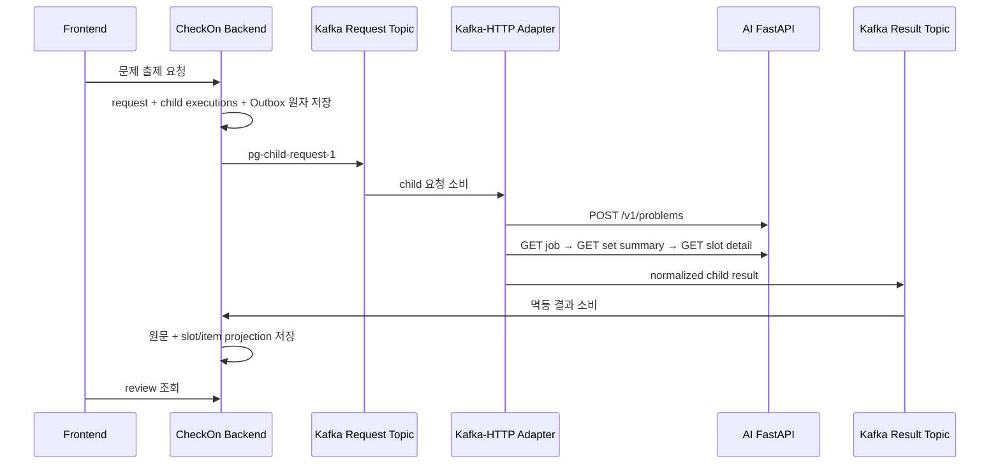

# 문제 출제 Backend–Kafka Adapter–AI 통합 계약

- Backend 기준: `dev`
- AI HTTP 기준: `7bc3d6592c6ccd48432ba941053a0673a922dca6`
- 확정일: 2026-08-14
- 문서 상태: 확정 정책과 구현 예정 계약

이 문서는 문제 출제의 팀 간 책임 경계를 고정한다. AI HTTP 구현 완료, Adapter 구현 완료,
Backend 구현 완료, 실제 E2E 완료는 서로 다른 상태로 보고한다.

## 1. 책임 경계

- Frontend는 Backend REST만 호출한다.
- Backend는 인증·테넌트 소유권·alias·요청 snapshot·child fan-out·결과 mirror·교사 검토와 발행을 소유한다.
- Adapter는 Kafka Inbox/Outbox, AI HTTP, polling, timeout, HTTP retry, 응답 정규화를 소유한다.
- AI는 HTTP generation·verification 결과를 소유하며 Kafka를 직접 소비하거나 발행하지 않는다.
- Backend는 AI HTTP를 직접 호출하지 않는다.

## 2. 현재 상태

| 구분 | 상태 |
| --- | --- |
| Backend 부모 요청·child fan-out·Transactional Outbox·결과 consumer | 구현됨 |
| Backend node provenance·dropped slot projection·3 MiB 초과 정책 | 구현 예정 |
| Adapter 기존 problem-generation worker | 이전 AI 계약 기준 구현, 본 문서에 맞춘 변경 필요 |
| AI generation·job·summary·detail·revision HTTP | AI 팀 기준 커밋에서 구현·테스트됨 |
| revision BE·Adapter·Frontend 연동 | 영상 MVP 제외 |
| AI→Adapter→Kafka→Backend→review 실제 E2E | 미검증 |

AI 팀이 제공한 Ruff, Mypy, offline 3,325건, PostgreSQL integration 158건 결과는 AI 팀 근거다.
Backend 팀이 같은 commit에서 독립 재실행한 결과로 표현하지 않는다.

## 3. Step 1 diagnosis와 node 선택

AI diagnosis 응답의 `weakness_map.nodes`가 출제 node 후보의 정본이다. Adapter는 taxonomy catalog,
`area_tag`, `type_affinity` 또는 정렬 순서로 node를 새로 선택하거나 치환하지 않는다.

Backend의 cell별 선택 규칙은 다음과 같다.

1. 사용자가 선택한 cell과 연결된 node만 후보로 둔다.
2. 후보 중 `weak_confirmed`가 하나 이상이면 그 tier의 node를 모두 선택한다.
3. `weak_confirmed`가 없으면 `suspect` tier의 node를 모두 선택한다.
4. 같은 tier의 node ID는 멱등 payload 직렬화를 위해 사전순으로 정렬한다. 이 정렬은 추천·심각도·교육과정 순위를 뜻하지 않는다.
5. 두 tier 모두 후보가 없으면 AI를 호출하지 않고 child를 `NO_EVIDENCE_READY_TARGET`로 종결한다.

Backend는 child snapshot에 다음 provenance를 저장한다.

- 선택한 `skill_node_id[]`
- `weakness_map.snapshot_hash`
- `weakness_map.taxonomy_version`
- `weakness_map.graph_version`
- `weakness_map.config_version`

AI `POST /v1/problems`에는 선택한 node를 문자열 변경 없이 `manual_targets`로 전달하고 diagnosis의
`snapshot_hash`, `taxonomy_version`을 그대로 보낸다. `graph_version`, `config_version`은 AI request의
extra field가 되므로 보내지 않고 Backend provenance로만 저장한다.

## 4. child 요청과 식별자

Backend 부모의 영역×유형 target 하나마다 child execution 하나와 `pg-child-request-1` Outbox 이벤트를
만든다. 한 child의 다음 식별자를 합치지 않는다.

| 식별자 | 소유자 | 규칙 |
| --- | --- | --- |
| `problem_request_id` | Backend | 부모 상관관계 |
| `problem_execution_id` | Backend | child 정본 |
| `target_index` | Backend | immutable targets의 0-based index |
| `adapter_execution_id` | Adapter | Inbox 최초 등록 시 생성하고 고정 |
| `execution_id` | AI | POST 응답 값을 정본으로 저장 |
| `job_id` | AI | polling 경로 |
| `set_id` | AI | summary·detail 경로 |

Adapter는 결과에 `problem_request_id`, `problem_execution_id`, `target_index`,
`adapter_execution_id`, AI `execution_id`·`job_id`·`set_id`를 되돌린다. Backend는 요청 snapshot 및
기존 값과 불일치한 결과를 계약 오류로 DLT에 격리한다.

## 5. opaque alias와 개인정보

- tenant: `tn_` + lowercase hex 32자리
- student target: `st_` + lowercase hex 32자리
- class target: `cl_` + lowercase hex 32자리

Backend는 인증된 `teacherProfileId`로 테넌트를 결정하고 alias로 변환한다. Adapter는 AI HTTP 호출 전에
`target_kind=student`이면 `st_`, `target_kind=class`이면 `cl_`, tenant는 `tn_` 형식을 검증한다.
내부 학생·반 UUID, 실명, 연락처는 Kafka와 AI HTTP에 넣지 않는다.

## 6. AI HTTP 호출 순서

1. `POST /v1/problems`
   - read timeout 300초
   - `job_id`, POST `execution_id` 즉시 영속
2. `GET /v1/problems/{job_id}`
   - `data.status`가 종료 판정 정본
   - `queued`, `running`에서만 polling
   - `Retry-After`는 다음 polling 간격의 advisory
3. `succeeded`이면 `data.result.set_id` 저장
4. `GET /v1/problems/{set_id}/items`로 summary와 `status_counts` 조회
5. 각 `slot_index`에 대해 `GET /v1/problems/{set_id}/items/{slot_index}` 조회

Adapter의 child 관찰 상한은 21분이다. 초과하면 `timed_out`으로 종결한다. 늦게 확인된 AI 성공은 감사
대상으로만 남기며 terminal child나 부모 상태를 되돌리지 않는다. 네트워크·timeout·408·429·5xx만
제한 재시도하고 400·404·409와 계약 오류는 같은 요청으로 재시도하지 않는다.

## 7. 문항·정답·검증 상태

- AI `answer.correct_no`와 `choices[].no`는 1-based 원문을 보존한다.
- Backend 호환 `correct_option_index = correct_no - 1`은 파생값이며 원문을 덮어쓰지 않는다.
- `verified` → `PASSED`
- `needs_review` → `REVIEW_REQUIRED`
- `verification_unavailable` → `UNVERIFIABLE`
- `dropped` → `EXCLUDED`

AI 검증 상태는 교사 승인 상태가 아니다. `UNVERIFIABLE`, `EXCLUDED`는 발행할 수 없다.

### dropped slot

다음 값을 원문 그대로 보존한다.

- `slot_index`
- `status=dropped`
- `item_id=null`
- `failure_reason`
- nullable `failure_detail`
- 세트 `status_counts`
- 요청 수와 처리 수

존재하지 않는 stem·choices·answer를 만들지 않는다. Backend는 실제 문항 테이블과 별도로 nullable item
참조를 가진 slot projection을 사용해 dropped 위치와 count를 복원한다.

## 8. Adapter→Backend Kafka 결과 크기

AI 문항 문자열에는 계약상 최대 길이가 없으므로 20문항의 최대 byte 크기를 가정하지 않는다.

- Adapter는 summary와 slot detail을 durable work ledger에 먼저 저장한다.
- normalized Kafka record value를 UTF-8로 직렬화한 실제 크기가 3 MiB 이하일 때만 한 child 성공 이벤트에 slot 전량을 싣는다.
- 3 MiB를 넘으면 Backend가 해석할 수 없는 `result_ref` 성공 이벤트를 만들지 않는다.
- 영상 MVP에서는 해당 child를 `RESULT_TOO_LARGE` 실패로 종결한다.
- Adapter 소유 영속 조회 API, slot event, chunk event는 후속 계약이며 구현 전 schema·순서·완료 조건을 별도로 확정한다.

결과와 Outbox는 같은 Adapter DB 트랜잭션으로 저장하고 broker ack 뒤 published로 전환한다. 결과 이벤트는
tenant alias를 Kafka key로 사용한다.

## 9. 부모 집계와 부분 성공

- 실행 중 child가 하나라도 있으면 `RUNNING`
- 전부 종단이고 성공 문항이 있으며 실패 child가 없으면 `SUCCEEDED`
- 성공 문항과 실패 child가 함께 있으면 `PARTIAL_SUCCESS`
- 성공 문항이 없고 실패 child가 있으면 `FAILED`
- 전부 `REJECTED_INSUFFICIENT`인 0건 결과는 업무상 완료로 취급

`PARTIAL_SUCCESS`에서도 성공 문항의 review·선택·저장·발행은 가능하다. AI 검증, 교사 선택, 저장,
발행 상태는 서로 합치지 않는다.

## 10. revision 범위

AI의 language `ai_refine` API는 기준 commit에 구현돼 있지만 영상 MVP의 Backend·Adapter·Frontend
연동에서는 제외한다. 현재 화면은 수정 버튼과 revision 이력 E2E를 완료 기능으로 표시하지 않는다.

후속 도입 시 먼저 다음을 계약한다.

- Backend revision REST API
- Backend→Adapter command와 멱등 키
- `set_id`, `slot_index`, `base_revision_no` 소유권 검증
- revision `execution_id`와 원 generation 식별자 관계
- 결과 projection과 stale/in-progress 충돌 처리

수정 가능 여부는 영역 하드코딩이 아니라 AI detail의 `available_actions`를 정본으로 사용한다.

## 11. 완료 조건

다음이 모두 충족되기 전에는 문제 출제 실제 E2E 완료로 보고하지 않는다.

- diagnosis node·snapshot hash·taxonomy version이 child AI 요청까지 동일하게 전달됨
- `problem_execution_id`, `target_index`, tenant alias, Adapter/AI ID 불일치가 차단됨
- job → set summary → 모든 slot detail 순서가 실제 AI HTTP에서 통과함
- dropped slot과 `status_counts`가 Backend review에서 동일하게 복원됨
- 1-based answer 원문과 0-based 파생값이 함께 검증됨
- 3 MiB 이하 성공과 초과 `RESULT_TOO_LARGE`가 각각 검증됨
- Adapter Inbox/Outbox 재시작 복구와 21분 timeout이 검증됨
- AI→Adapter→Kafka→Backend→review 화면 E2E가 최소 1회 통과함

## 12. 구현 전 동기화 대상

- `docs/POLICY_REGISTER.md` PG-003~005
- Adapter normalized request/result fixtures
- Backend Flyway: diagnosis provenance와 slot projection
- Backend result parser/projector
- Problem Studio OpenAPI와 BDD 통합 테스트
- 운영 설정: Kafka 3 MiB 제한, timeout, topic·consumer group
