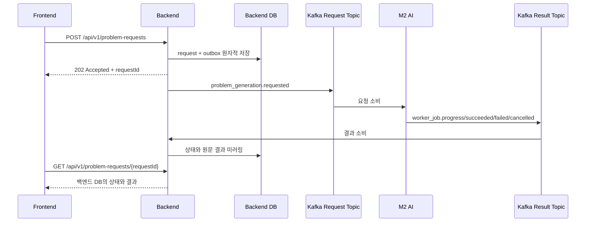

# M2 문제 출제 백엔드 구현·AI 연동 명세

- 문서 대상: M2 AI 문제 출제 팀
- 백엔드 구현 기준: `codex/feature/problem-generation-kafka-recovery/37`, commit `49f46cb`
- 작성일: 2026-08-12
- 기준 문서: `14_m2_backend_erd (1).md`, `15_m2_backend_integration_spec (1).md` (2026-08-07)
- 문서 상태: 현재 구현 설명 + AI 팀 확인이 필요한 임시 계약

## 1. 먼저 확인할 핵심 변경

2026-08-07 문서에는 백엔드가 AI의 `POST /v1/problems`를 호출하고, 완료 이벤트를 받은 뒤
`GET /v1/problems/{job_id}`로 결과를 회수하는 안이 적혀 있다.

현재 백엔드는 최종 목표에 맞춰 다음과 같이 구현했다.

1. 프론트엔드는 백엔드 REST API로 출제를 요청한다.
2. 백엔드는 요청과 Kafka Outbox를 같은 DB 트랜잭션에 저장한다.
3. 백엔드는 AI 요청 토픽에 `problem_generation.requested` 이벤트를 발행한다.
4. AI는 요청 이벤트를 소비하고 문제를 생성한다.
5. AI는 진행·성공·실패·취소 결과를 결과 토픽에 발행한다.
6. 백엔드는 결과 이벤트를 소비해 자체 DB에 즉시 미러링한다.
7. 프론트엔드는 백엔드 DB만 조회한다.

따라서 **현재 구현에는 AI의 `POST /v1/problems`, `GET /v1/problems/{job_id}`를 호출하는 HTTP
클라이언트가 없다.** 기존 문서의 300초 HTTP read timeout도 현재 Kafka 경로에는 적용되지 않는다.



## 2. 이번 백엔드 구현 범위

| 구분 | 구현 상태 | 내용 |
| --- | --- | --- |
| 프론트 요청 API | 구현 | 문제 출제 요청 생성, 멱등 재요청 처리 |
| 프론트 조회 API | 구현 | 백엔드 DB에 저장된 상태·결과 조회 |
| 대상 검증 | 구현 | 인증 강사의 ACTIVE 학생 관계 또는 ACTIVE 클래스만 허용 |
| AI alias | 구현 | `tn_`, `st_`, `cl_` opaque alias 생성·재사용 |
| Kafka 요청 발행 | 구현 | Transactional Outbox, 재시도, 발행 실패 상태 |
| Kafka 결과 소비 | 구현 | 진행·성공·실패·취소, 멱등 처리, 계약 검증, DLT |
| 결과 미러링 | 구현 | `result`, `versions` JSON 원문과 주요 ID 저장 |
| 테넌트 격리 | 구현 | 애플리케이션 검증 + PostgreSQL FORCE RLS |
| OpenAPI | 구현 | 프론트→백엔드 두 엔드포인트 반영 |
| 문항 목록·상세 | 미구현 | Step 3 상세 계약 및 투영 모델 확정 필요 |
| 문항 수정·교체·삭제 | 미구현 | 경로와 동기/비동기 계약 확정 필요 |
| 강사 승인·학생 발행 | 미구현 | 백엔드 소유 도메인이지만 이번 범위 밖 |
| 자동 약점 출제 | 미구현 | `weakness_auto` AI 배선 전 |
| taxonomy 조회 | 미구현 | 스킬 노드 목록 제공 주체/API 미확정 |
| 요청 쿼터 | 미구현 | 기간·상한·초과 응답 정책 미확정 |

## 3. 현재 허용하는 v1 요청 범위

| 항목 | 현재 값 |
| --- | --- |
| 출제 방식 | `teacher_manual` 고정 |
| 대상 종류 | `STUDENT`, `CLASS` |
| 영역 | `language` 고정 |
| 문항 형식 | `mcq` 고정 |
| 지문 | `null` 고정 |
| 문항 수 | 1~10 |
| 직접 목표 | `manualTargets` 1~20개 |
| 유형 태그 | `FACT`, `INFER`, `CRITIC`, `CONCEPT` 중 1~4개 |
| 난이도 | `LOW`, `MEDIUM`, `HIGH`, 또는 미지정 |
| AI 내부 target | `auto` 고정 |

기존 AI 문서에는 count 최대 20이 적혀 있지만, 현재 백엔드는 초기 운영 안전값으로 **최대 10개**만
허용한다. AI 팀이 처리 시간과 용량 기준을 확정하면 설정 또는 계약 변경을 별도로 협의한다.

## 4. 프론트엔드 → 백엔드 REST API

두 API 모두 Bearer 인증과 `TEACHER` 권한이 필요하다. 테넌트는 요청 body의 ID가 아니라 인증된
`teacherProfileId`로 결정한다.

### 4.1 문제 출제 요청

```http
POST /api/v1/problem-requests
Authorization: Bearer <access-token>
Idempotency-Key: pg-client-20260812-0001
Content-Type: application/json
```

```json
{
  "targetKind": "STUDENT",
  "targetId": "0198f000-0000-7000-8000-000000000003",
  "manualTargets": ["skill.grammar.001"],
  "taxonomyVersion": "2026.08",
  "typeTags": ["CONCEPT"],
  "count": 3,
  "requestedDifficulty": "MEDIUM"
}
```

#### 요청 필드

| 필드 | 필수 | 제약 | 설명 |
| --- | --- | --- | --- |
| `targetKind` | O | `STUDENT`, `CLASS` | 출제 대상 종류 |
| `targetId` | O | UUID | 백엔드 내부 대상 ID. AI에는 전달하지 않음 |
| `manualTargets` | O | 1~20개, 중복 금지 | AI taxonomy의 스킬 노드 ID |
| `taxonomyVersion` | O | 1~80자 | 스킬 taxonomy 버전 |
| `typeTags` | O | 1~4개, 중복 금지 | `FACT`, `INFER`, `CRITIC`, `CONCEPT` |
| `count` | O | 1~10 | 생성 문항 수 |
| `requestedDifficulty` | X | `LOW`, `MEDIUM`, `HIGH` | 미지정 시 AI payload의 값은 `null` |

`manualTargets` 값은 `[a-zA-Z0-9][a-zA-Z0-9._:-]{0,119}` 형식이어야 한다. 백엔드는
`manualTargets`와 `typeTags`를 정렬한 뒤 snapshot hash를 만든다.

#### `Idempotency-Key`

- 필수 헤더다.
- 길이는 8~200자다.
- 허용 문자는 영문 대소문자, 숫자, `.`, `_`, `:`, `-`다.
- 같은 강사 + 같은 키 + 같은 정규화 payload면 기존 요청을 `202`로 재사용한다.
- 같은 강사 + 같은 키 + 다른 payload면 `409 IDEMPOTENCY_CONFLICT`다.
- 프론트의 키는 AI에 그대로 전달하지 않는다. 백엔드는 별도의 AI용 `pg_...` 키를 만든다.

#### 성공 응답

```http
HTTP/1.1 202 Accepted
Location: /api/v1/problem-requests/0198f100-0000-7000-8000-000000000001
```

```json
{
  "requestId": "0198f100-0000-7000-8000-000000000001",
  "targetKind": "STUDENT",
  "status": "QUEUED",
  "jobId": null,
  "executionId": null,
  "setId": null,
  "resultStatus": null,
  "errorCode": null,
  "result": null,
  "versions": null,
  "requestedAt": "2026-08-12T05:00:00Z",
  "dispatchedAt": null,
  "completedAt": null,
  "replayed": false
}
```

동일한 요청을 같은 멱등 키로 다시 보내면 `requestId`는 같고 `replayed`가 `true`다.
Outbox publisher가 매우 빠르게 동작하면 최초 POST 응답 시점의 `status`가 이미 `DISPATCHED`일 수도
있으므로, 위 `QUEUED` 응답은 대표 예시다.

#### 오류 응답

| HTTP | code | 의미 |
| --- | --- | --- |
| 400 | `INVALID_REQUEST` | 형식·범위·필수값 오류 |
| 401 | `INVALID_TEACHER_PRINCIPAL` 또는 Security 응답 | 유효한 강사 인증 없음 |
| 403 | Security 응답 | TEACHER 권한 없음 |
| 404 | `PROBLEM_TARGET_NOT_FOUND` | 대상이 없거나 다른 테넌트이거나 비활성 |
| 409 | `IDEMPOTENCY_CONFLICT` | 같은 키를 다른 요청에 재사용 |

### 4.2 문제 출제 상태·결과 조회

```http
GET /api/v1/problem-requests/{requestId}
Authorization: Bearer <access-token>
```

AI 서버를 다시 호출하지 않고 백엔드 DB만 조회한다. 응답 형식은 POST의 `202` body와 같다.
요청이 없거나 다른 강사의 요청이면 존재 여부를 숨기기 위해 `404 PROBLEM_REQUEST_NOT_FOUND`를
반환한다. `replayed`는 POST 멱등 재사용 여부를 알려주는 필드이므로 GET 응답에서는 항상 `false`다.

## 5. 백엔드 → AI Kafka 요청 계약

### 5.1 기본 토픽

| 구분 | 기본값 | 방향 | key |
| --- | --- | --- | --- |
| 요청 토픽 | `checkon.ai.problem-generation.requests.v1` | 백엔드 → AI | `tenant_id` alias |
| 결과 토픽 | `checkon.ai.problem-generation.results.v1` | AI → 백엔드 | `tenant_id` alias 권장 |
| 결과 DLT | `checkon.backend.problem-generation.results.dlt.v1` | 백엔드 내부 격리 | 원본 key 유지 |
| 백엔드 consumer group | `checkon-backend-problem-generation-v1` | 결과 토픽 소비 | 해당 없음 |

토픽 이름은 환경변수로 바꿀 수 있다. 파티션 수·복제 계수·보존 기간과 AI 요청 consumer group은
아직 확정하지 않았다. 같은 강사의 요청 순서 보존을 위해 요청 key는 `tn_...` alias다.

### 5.2 Kafka record headers

백엔드가 요청 이벤트에 아래 UTF-8 string header를 넣는다.

| header | 값 |
| --- | --- |
| `event_id` | envelope의 `event_id` |
| `event_type` | `problem_generation.requested` |
| `schema_version` | `pg-request-1` |
| `correlation_id` | 백엔드 `problem_request_id` |
| `tenant_id` | `tn_...` alias |

메시지 key와 `tenant_id` header/envelope 값은 같은 alias다.

### 5.3 요청 이벤트 body

```json
{
  "event_id": "0198f100-0000-7000-8000-000000000101",
  "event_type": "problem_generation.requested",
  "occurred_at": "2026-08-12T05:00:00Z",
  "tenant_id": "tn_0123456789abcdef0123456789abcdef",
  "schema_version": "pg-request-1",
  "correlation_id": "0198f100-0000-7000-8000-000000000001",
  "causation_id": null,
  "payload": {
    "problem_request_id": "0198f100-0000-7000-8000-000000000001",
    "idempotency_key": "pg_0198f100000070008000000000000001",
    "request": {
      "target_kind": "student",
      "target_ref": "st_0123456789abcdef0123456789abcdef",
      "target_source": "teacher_manual",
      "manual_targets": ["skill.grammar.001"],
      "taxonomy_version": "2026.08",
      "area_tag": "language",
      "type_tags": ["concept"],
      "item_format": "mcq",
      "count": 3,
      "requested_difficulty": "medium",
      "target": "auto",
      "passage": null,
      "snapshot_hash": "sha256:<64 lowercase hex>"
    }
  }
}
```

#### AI가 요청에서 신뢰할 식별자

| 값 | 형식 | 용도 |
| --- | --- | --- |
| `event_id` | UUID | 같은 발행 이벤트의 중복 판별 |
| `problem_request_id` | UUID | 백엔드 요청 상관관계. 결과에 반드시 되돌려야 함 |
| `idempotency_key` | `pg_` + 32 lowercase hex | AI 생성 작업 멱등성 |
| `tenant_id` | `tn_` + 32 lowercase hex | 테넌트 라우팅·Kafka key |
| `target_ref` | `st_` 또는 `cl_` + 32 lowercase hex | 학생 또는 클래스 대상 alias |
| `snapshot_hash` | `sha256:` + 64 lowercase hex | 정규화된 AI 요청 snapshot 식별 |

`problem_request_id`는 백엔드가 소유한 기술 식별자다. 강사·학생·클래스의 실제 UUID나 실명은
요청 이벤트에 포함되지 않는다.

#### AI consumer에 필요한 멱등 처리

Kafka와 Outbox 특성상 같은 이벤트가 다시 전달될 수 있다.

1. AI는 최소한 `idempotency_key`를 영속 저장해 같은 논리 요청의 세트를 중복 생성하지 않아야 한다.
2. 같은 `event_id` 재수신도 안전하게 같은 처리 결과로 수렴해야 한다.
3. 처리 완료 후 재수신하면 기존 `job_id`, `execution_id`, `set_id`를 재사용해야 한다.
4. 멱등 정보가 AI 프로세스 메모리에만 있으면 재시작 후 중복 생성될 수 있으므로 영속 저장을 권장한다.

## 6. AI → 백엔드 Kafka 결과 계약

### 6.1 백엔드가 인식하는 event type

| event type | 백엔드 상태 | 비고 |
| --- | --- | --- |
| `worker_job.progress` | `RUNNING` | 선택적 진행 이벤트 |
| `worker_job.running` | `RUNNING` | 허용 |
| `worker_job.succeeded` | `SUCCEEDED` | 유효 결과가 저장된 경우 |
| `worker_job.failed` | `FAILED` | 실행 실패 |
| `worker_job.cancelled` | `CANCELLED` | 실행 취소 |
| `problem_generation.progress` | `RUNNING` | M2 전용 이름도 허용 |
| `problem_generation.running` | `RUNNING` | M2 전용 이름도 허용 |
| `problem_generation.succeeded` | `SUCCEEDED` | M2 전용 이름도 허용 |
| `problem_generation.failed` | `FAILED` | M2 전용 이름도 허용 |
| `problem_generation.cancelled` | `CANCELLED` | M2 전용 이름도 허용 |

`worker_job.*`을 사용할 때 `payload.worker_kind`가 있다면
`problem_generation`, `problem-generation`, `M2` 중 하나여야 한다. AI 팀의 기존 공통 worker event와
맞추기 위해 현재 권장값은 `problem_generation`이다.

### 6.2 공통 필수 규칙

| 필드 | 필수 | 규칙 |
| --- | --- | --- |
| `event_id` | O | UUID. 이벤트마다 새 값 |
| `event_type` | O | 위에서 지원하는 phase |
| `occurred_at` | O | offset이 포함된 ISO-8601 (`Z` 허용) |
| `tenant_id` | O | 요청에서 받은 `tn_[0-9a-f]{32}` 그대로 |
| `schema_version` | O | 비어 있지 않은 문자열 |
| `correlation_id` | 조건부 | `problem_request_id`와 둘 중 하나 이상 필수 |
| `payload` | O | JSON object |
| `payload.problem_request_id` | 조건부 | `correlation_id`와 둘 중 하나 이상 필수 |

`correlation_id`와 `payload.problem_request_id`를 둘 다 보내면 값이 정확히 같아야 한다. 안전한 상호
계약을 위해 **둘 다 보내는 것을 권장**한다.

Kafka record key도 `tenant_id`를 사용해야 같은 테넌트의 이벤트 순서를 유지할 수 있다. 현재 백엔드는
결과 record의 key/header가 아니라 **JSON body를 검증 기준**으로 사용한다.

### 6.3 성공 이벤트 권장 예시

```json
{
  "event_id": "0198f100-0000-7000-8000-000000000201",
  "event_type": "worker_job.succeeded",
  "occurred_at": "2026-08-12T05:01:20Z",
  "tenant_id": "tn_0123456789abcdef0123456789abcdef",
  "schema_version": "worker-job-1",
  "correlation_id": "0198f100-0000-7000-8000-000000000001",
  "payload": {
    "worker_kind": "problem_generation",
    "problem_request_id": "0198f100-0000-7000-8000-000000000001",
    "job_id": "job-20260812-0001",
    "execution_id": "execution-20260812-0001",
    "set_id": "set-20260812-0001",
    "result_status": "completed",
    "result": {
      "set_id": "set-20260812-0001",
      "status": "completed",
      "problems": [
        {
          "id": "problem-0001"
        }
      ]
    },
    "versions": {
      "model": "m2-v1",
      "prompt": "prompt-v1"
    }
  }
}
```

백엔드는 성공 이벤트에서 다음 값을 추출한다.

| 저장 값 | 탐색 순서 |
| --- | --- |
| `jobId` | `payload.job_id` |
| `executionId` | `payload.execution_id` → `meta.execution_id` |
| `setId` | `payload.set_id` → `payload.result.set_id` |
| `resultStatus` | `payload.result_status` → `result.status` → `result.outcome` |
| `result` | `payload.result`; 없으면 terminal 이벤트의 `payload` 전체 |
| `versions` | `payload.versions` → `meta.versions` |

### 6.4 진행 이벤트 예시

```json
{
  "event_id": "0198f100-0000-7000-8000-000000000202",
  "event_type": "worker_job.progress",
  "occurred_at": "2026-08-12T05:00:30Z",
  "tenant_id": "tn_0123456789abcdef0123456789abcdef",
  "schema_version": "worker-job-1",
  "correlation_id": "0198f100-0000-7000-8000-000000000001",
  "payload": {
    "worker_kind": "problem_generation",
    "problem_request_id": "0198f100-0000-7000-8000-000000000001",
    "job_id": "job-20260812-0001",
    "execution_id": "execution-20260812-0001",
    "phase": "running",
    "progress": 0.5
  }
}
```

진행 이벤트에서는 `result`를 저장하지 않는다. `progress` 값도 현재 백엔드 응답 모델에는 투영하지
않으며, 상태만 `RUNNING`으로 반영한다.

### 6.5 실패 이벤트 예시

```json
{
  "event_id": "0198f100-0000-7000-8000-000000000203",
  "event_type": "worker_job.failed",
  "occurred_at": "2026-08-12T05:01:20Z",
  "tenant_id": "tn_0123456789abcdef0123456789abcdef",
  "schema_version": "worker-job-1",
  "correlation_id": "0198f100-0000-7000-8000-000000000001",
  "payload": {
    "worker_kind": "problem_generation",
    "problem_request_id": "0198f100-0000-7000-8000-000000000001",
    "job_id": "job-20260812-0001",
    "execution_id": "execution-20260812-0001",
    "error_code": "LLM_UNAVAILABLE",
    "error": {
      "code": "LLM_UNAVAILABLE"
    }
  }
}
```

`error_code` 탐색 순서는 `payload.error_code` → `payload.error.code`다. 두 값이 모두 없으면 백엔드는
`AI_EXECUTION_FAILED`를 저장한다.

`partial_success`, `rejected_insufficient`처럼 유효한 결과가 만들어진 경우는 실패 이벤트가 아니라
`succeeded` 이벤트로 보내고 `result_status` 또는 `result.status`로 세트 결과를 표현해야 한다.

### 6.6 취소 이벤트

취소는 실패 이벤트와 같은 envelope을 사용하되 `event_type`을 `worker_job.cancelled` 또는
`problem_generation.cancelled`로 보낸다. 백엔드는 상태를 `CANCELLED`로 저장한다.

## 7. 결과 본문과 `result_ref`에 대한 현재 결정 필요 사항

기존 AI 문서는 Kafka 이벤트에 문항 본문을 싣지 않고 `result_ref`를 보낸 뒤 REST로 회수하는 방식을
제안했다. 반면 현재 백엔드는 AI REST 조회 클라이언트가 없고, 성공 이벤트의 `payload.result`를 원문
JSON으로 저장하도록 구현돼 있다.

따라서 현재 상태는 다음과 같다.

- AI가 `payload.result` 전체를 보내면 백엔드가 즉시 저장하고 프론트 조회 API로 반환할 수 있다.
- AI가 `result_ref`만 보내면 백엔드는 참조 값을 포함한 payload는 저장하지만, AI를 다시 호출해 문항
  본문을 가져오지 않는다.
- Step 3 문항 목록·상세·수정 기능은 어느 방식이 확정되든 추가 구현이 필요하다.

운영 전 아래 중 하나를 확정해야 한다.

1. **전체 결과 이벤트 방식:** 가명화·크기 제한을 전제로 `payload.result` 전체를 Kafka에 싣는다.
2. **결과 참조 방식:** AI가 영속 결과 API를 제공하고, 백엔드가 `result_ref`로 조회하는 클라이언트를
   추가한다.

현재 end-to-end 테스트와 구현된 미러링 동작을 그대로 사용하려면 1번 방식이 필요하다. 다만 개인정보성
텍스트, Kafka message size, 토픽 보존 정책을 함께 검토해야 하므로 최종 확정 계약으로 간주하지 않는다.

## 8. 상태와 전이

| 백엔드 상태 | 진입 시점 | 프론트 의미 |
| --- | --- | --- |
| `QUEUED` | 요청과 Outbox 저장 완료 | Kafka 발행 대기 |
| `DISPATCHED` | Kafka broker가 요청 발행을 확인 | AI 요청 토픽 전달 완료 |
| `RUNNING` | AI 진행/실행 이벤트 수신 | AI 생성 중 |
| `SUCCEEDED` | AI 성공 이벤트 수신 | 결과 조회 가능 |
| `FAILED` | AI 실패 이벤트 수신 | `errorCode` 확인 |
| `CANCELLED` | AI 취소 이벤트 수신 | 요청 취소됨 |
| `DELIVERY_FAILED` | 요청 이벤트 발행이 최대 횟수 실패 | AI까지 요청을 전달하지 못함 |

`SUCCEEDED`, `FAILED`, `CANCELLED`는 terminal 상태다. terminal 상태를 다른 phase로 바꾸는 이벤트는
계약 위반으로 DLT에 격리한다. 같은 terminal phase의 동일 이벤트 재전송은 멱등 처리된다.

`DELIVERY_FAILED`는 AI 실행 결과가 아니라 백엔드→Kafka 전달 실패 상태다. 늦게 전달된 유효 AI 결과가
있다면 현재 구현은 그 결과 상태로 갱신할 수 있다.

## 9. 결과 이벤트 멱등성·불변식

백엔드는 결과 처리 시 다음 규칙을 적용한다.

1. `event_id`와 수신 원문 payload의 SHA-256 hash를 저장한다.
2. 같은 `event_id` + 같은 payload 재수신은 아무 작업 없이 성공 처리한다.
3. 같은 `event_id` + 다른 payload는 계약 위반이다.
4. 한 `problem_request_id`에서 한 번 저장된 `job_id`, `execution_id`, `set_id`가 뒤 이벤트에서 다른
   값으로 바뀌면 계약 위반이다.
5. 요청의 `tenant_id` alias와 결과의 `tenant_id`가 다르면 계약 위반이다.
6. `problem_request_id`가 없거나 백엔드 요청을 찾을 수 없으면 계약 위반이다.
7. terminal 상태를 상충하는 다른 terminal/진행 상태로 바꿀 수 없다.

AI는 한 요청의 전체 생명주기 동안 `job_id`, `execution_id`, `set_id`를 안정적으로 유지해야 한다.

## 10. 재시도와 DLT

### 10.1 백엔드 → AI 요청 발행

- 요청 DB 저장과 Outbox 저장은 한 트랜잭션이다.
- 실제 Kafka 발행은 DB 트랜잭션 밖에서 수행한다.
- 기본 poll 주기: 1초
- 기본 batch: 20개
- broker ack 대기 timeout: 10초
- 기본 최대 발행 시도: 5회
- 재시도 지연: 2초, 4초, 8초, 16초 순의 지수 backoff
- `PUBLISHING` 상태가 기본 1분 이상 남으면 중단된 claim으로 보고 다시 가져온다.
- 최대 시도 후 Outbox는 `DEAD`, 요청은 `DELIVERY_FAILED`, `errorCode`는
  `KAFKA_DELIVERY_FAILED`가 된다.

Transactional Outbox는 at-least-once 전달이므로 AI consumer의 멱등 처리가 필수다.

### 10.2 AI → 백엔드 결과 소비

- JSON 파싱 실패, 필수 필드 누락, 잘못된 alias, tenant/request 불일치, event ID 재사용, 안정 ID 변경,
  terminal 상태 충돌은 계약 오류다.
- 계약 오류는 재시도하지 않고 즉시 DLT로 보낸다.
- DB 일시 오류 등 그 밖의 처리 실패는 1초 간격으로 2회 재시도한 뒤 DLT로 보낸다.
- DLT는 원본 record의 partition을 유지한다. 결과 토픽과 DLT의 파티션 수를 호환되게 생성해야 한다.

DLT 운영 알림·재처리 도구는 이번 범위에 포함하지 않았다.

## 11. alias와 데이터 경계

| alias | 의미 | 형식 |
| --- | --- | --- |
| tenant alias | 인증 강사 테넌트 | `tn_[0-9a-f]{32}` |
| student alias | 강사 테넌트 안의 학생 | `st_[0-9a-f]{32}` |
| class alias | 강사 소유 클래스 | `cl_[0-9a-f]{32}` |

- alias는 랜덤 16 bytes를 lowercase hex로 표현한다.
- 한 대상에는 저장된 기존 alias를 재사용한다.
- Kafka 요청에 강사 UUID, 학생 UUID, 클래스 UUID, 실명을 넣지 않는다.
- `manual_targets`는 개인정보 alias가 아니라 AI taxonomy의 논리 스킬 노드 ID다.
- AI 결과에도 실제 개인 식별자나 실명을 넣지 않아야 한다.
- `tenant_id`는 백엔드가 제공한 `tn_...` 값을 그대로 되돌려야 한다.

## 12. 백엔드 저장 범위

백엔드는 다음 데이터를 영속 저장한다.

- 백엔드 요청 ID와 인증 강사 소유 관계
- tenant/student/class alias 연결
- 프론트 멱등 키와 AI 멱등 키
- 정규화된 AI 요청 snapshot과 hash
- 요청 상태와 요청·발행·완료 시각
- AI `job_id`, `execution_id`, `set_id`, `result_status`, `error_code`
- AI `result`, `versions` 원문 JSON
- Kafka Outbox 상태·시도·오류
- 소비한 결과 `event_id`와 payload hash

문항별 `problem_item_mirror`, 승인 상태, 발행 상태는 아직 만들지 않았다. `result` 원문을 먼저 보존하고
후속 상세 계약이 확정되면 별도 read model로 투영할 예정이다.

문제 출제 관련 신규 테이블은 PostgreSQL FORCE RLS로 강사 테넌트를 격리한다. 다른 강사의 요청은
애플리케이션 조회 조건과 DB 정책 양쪽에서 접근할 수 없다.

## 13. 백엔드 설정

문제 출제 Kafka 연동은 기본적으로 꺼져 있다. 실제 연동 환경에서는
`AI_PROBLEM_KAFKA_ENABLED=true`가 필요하다.

| 환경변수 | 기본값 | 의미 |
| --- | --- | --- |
| `AI_PROBLEM_KAFKA_ENABLED` | `false` | 요청 publisher·결과 consumer 활성화 |
| `AI_PROBLEM_REQUEST_TOPIC` | `checkon.ai.problem-generation.requests.v1` | 백엔드→AI 요청 토픽 |
| `AI_PROBLEM_RESULT_TOPIC` | `checkon.ai.problem-generation.results.v1` | AI→백엔드 결과 토픽 |
| `AI_PROBLEM_DLT_TOPIC` | `checkon.backend.problem-generation.results.dlt.v1` | 결과 계약/처리 실패 DLT |
| `AI_PROBLEM_CONSUMER_GROUP` | `checkon-backend-problem-generation-v1` | 백엔드 결과 consumer group |
| `AI_PROBLEM_OUTBOX_BATCH_SIZE` | `20` | 한 번에 claim할 Outbox 수, 1~100 |
| `AI_PROBLEM_OUTBOX_MAX_ATTEMPTS` | `5` | 발행 최대 시도, 1~20 |
| `AI_PROBLEM_OUTBOX_PUBLISH_TIMEOUT` | `10s` | Kafka 발행 ack timeout |
| `AI_PROBLEM_STALE_CLAIM_AFTER` | `1m` | 중단된 PUBLISHING 회수 기준 |
| `AI_PROBLEM_OUTBOX_POLL_DELAY` | `1s` | Outbox poll 주기 |

공통 Kafka broker 주소는 `KAFKA_BOOTSTRAP_SERVERS`로 설정한다. TLS/SASL, ACL과 인증서 설정은 아직
운영 계약이 확정되지 않았다.

## 14. AI 팀 확인 요청

아래 항목을 AI 팀 최신 T5 결정과 대조해 달라.

| 우선순위 | 확인 항목 | 현재 백엔드 가정 |
| --- | --- | --- |
| 필수 | 요청·결과를 모두 Kafka로 처리 가능한가 | 가능하다고 가정 |
| 필수 | 요청 토픽 이름과 AI consumer group | 토픽 기본값만 제안, group 미확정 |
| 필수 | 결과 토픽 이름·파티션 수 | 이름 기본값만 제안, 파티션 미확정 |
| 필수 | AI가 `idempotency_key`를 영속 처리하는가 | 반드시 필요 |
| 필수 | 결과에 `problem_request_id`/`correlation_id`를 돌려줄 수 있는가 | 둘 다 같은 값으로 전송 권장 |
| 필수 | 전체 `result`와 `result_ref` 중 어느 방식인가 | 현재 E2E는 전체 `result` 필요 |
| 필수 | 실제 성공·실패·진행 fixture | 현재 예시와 상호 계약 테스트 필요 |
| 높음 | `worker_job.*`와 `problem_generation.*` 중 표준 event type | 둘 다 수신 가능, 전자는 권장 |
| 높음 | `schema_version` 최종값 | 요청은 `pg-request-1`, 결과는 AI 소유 |
| 높음 | AI 결과 영속화와 다중 인스턴스 지원 여부 | 백엔드는 결과 수신 즉시 미러링 |
| 높음 | broker TLS/SASL·ACL·토픽 retention | 미확정 |
| 보통 | taxonomy 목록 조회 API 제공 주체 | 미확정 |
| 보통 | Step 3 목록·상세·수정·교체·삭제 계약 | 미구현 |
| 보통 | `weakness_auto` 개방 시점 | 현재 비활성 |

특히 다음 fixture 4개를 AI/백엔드 양쪽 CI에서 공유하면 연동 오류를 가장 빨리 줄일 수 있다.

1. `problem_generation.requested` 요청 이벤트
2. `worker_job.progress` 진행 이벤트
3. `worker_job.succeeded` 전체 결과 이벤트
4. `worker_job.failed` 오류 이벤트

## 15. 구현 검증 범위

BDD 형식의 테스트로 다음을 검증했다.

- 학생/클래스 출제 요청 성공
- 다른 강사의 학생·클래스 접근 차단
- 같은 멱등 키 재요청과 충돌
- 내부 UUID가 AI payload에 포함되지 않음
- 요청 DB 저장과 Outbox 저장
- Kafka 요청 key·header·body
- 성공 결과 소비와 원문 결과·버전 저장
- 같은 결과 이벤트 중복 소비
- 같은 `event_id`의 payload 충돌 차단
- 잘못된 tenant alias 차단 및 DLT
- terminal 상태 보호
- Outbox 재시도·DEAD·`DELIVERY_FAILED`
- Flyway 스키마·제약·RLS
- OpenAPI 계약

최신 `dev` 반영 기준 전체 테스트 200개와 Gradle build가 통과했다.

## 16. 관련 백엔드 파일

| 파일 | 책임 |
| --- | --- |
| `src/main/java/com/checkon/problem/presentation/ProblemGenerationController.java` | 프론트 REST API |
| `src/main/java/com/checkon/problem/application/ProblemGenerationRequestService.java` | 요청 검증·alias·멱등·Outbox 원자 저장 |
| `src/main/java/com/checkon/problem/integration/kafka/KafkaProblemGenerationEventPublisher.java` | Kafka 요청 record 발행 |
| `src/main/java/com/checkon/problem/integration/kafka/ProblemGenerationResultEventParser.java` | AI 결과 envelope 해석·계약 검증 |
| `src/main/java/com/checkon/problem/application/ProblemGenerationResultProcessor.java` | 멱등 결과 저장·상태 불변식 |
| `src/main/java/com/checkon/problem/infrastructure/outbox/ProblemGenerationOutboxCoordinator.java` | Outbox claim·재시도·상태 전이 |
| `src/main/resources/db/migration/V16__create_problem_generation_kafka_boundary.sql` | 테이블·제약·RLS |
| `src/main/resources/openapi/dashboard-api.yaml` | 프론트 REST OpenAPI |
| `docs/PROBLEM_GENERATION_KAFKA_DECISIONS.md` | 안전 기본값과 미확정 결정 기록 |

---

이 문서는 현재 백엔드 구현을 설명한다. AI 팀의 T5 최종 계약과 다른 부분이 확인되면 요청/결과 변환을
Kafka integration 계층에서 교체하고, OpenAPI·Flyway·테스트·이 문서를 함께 갱신한다.
